# VDSS - Vehicle Dynamics Safety Simulator

## Overview
VDSS provides a MATLAB based environment for simulating vehicle dynamics and safety scenarios. The top level `VDSS` function sets up the user interface, loads vehicle configurations and executes simulations through the `SimManager` class. The design follows a modular approach where each toolbox encapsulates a specific subsystem (e.g., controls, physics, plotting). Users can modify parameters or replace components without rewriting the entire simulator.

## Quick Start
1. Open MATLAB and add this repository to the path with `addpath(genpath(pwd))`.
2. Run `VDSS` to launch the graphical interface and start a default simulation.
3. Use the menu options to load vehicle parameter files, start/stop runs and save results.
4. The `Simulations` directory contains several ready-made examples. Open any MAT file there and click **Run** to reproduce the scenario.

## Table of Contents
- [Directory Structure](#directory-structure)
- [Toolboxes](#toolboxes)
- [Mechanics](#mechanics)
- [Mechanical Model Blocks](#mechanical-model-blocks)
- [Physics Models](#physics-models)
- [Physics](#physics)

## Directory Structure
- `Source/` – MATLAB toolboxes that implement the simulator.
- `Scripts/` – Utility scripts and MEX wrappers.
- `Simulations/` – Example configurations and output data.
- `Curves/` – Acceleration, braking and steering profiles used by the controllers.
- `tests/` – Unit tests for core algorithms.
- `codegen/` – Generated binaries when MEX wrappers are built.
- `VDSS.m` – Entry point that constructs the GUI and orchestrates components.

## Toolboxes
### Plotting
`PlotManager` and `VehiclePlotter` create figures, animate trajectories and manage overlays. Typical use is:
```matlab
pm = PlotManager();
pm.createFigure('Position', [100 100 800 600]);
VehiclePlotter.plotVehicle(pm, vehicleState);
```
The plots update in real time as the simulation runs.

### GUI
`UIManager` builds the main window and configuration tabs while `DataManager` stores simulation data shared across modules. Widgets allow editing parameters live and displaying simulation status.

### Vehicle Model
`VehicleModel` aggregates all controllers and mechanical subsystems. `VehicleParameters` defines default masses and geometry. `VehicleGUIManager` links GUI widgets to model fields. A vehicle instance is assembled from building blocks like engine, transmission, suspension and tire objects. Relationships among components are shown below:
```
[Engine] --torque--> [Transmission] --force--> [Tires] --grip--> [Chassis]
```

### Simulation
`SimManager` orchestrates vehicle instances, runs the physics engine and handles collision detection. Time integration occurs inside `runStep`, which updates every vehicle and the 3‑D world.

### Mapping
`LaneMap` holds waypoint data and `VehicleLocalizer` computes curvature for path following. Maps can be generated programmatically using `mapCommands` strings or loaded from CSV files.

### Configuration
`ConfigurationManager` saves and loads XML configurations and simulation results. Each configuration captures parameter sets, map commands and run logs for later replay.

### Physics
Includes `KinematicsCalculator`, `ForceCalculator`, `DynamicsUpdater`, `CollisionDetector`, `VehicleCollisionSeverity`, `SurfaceFrictionManager` and `StabilityChecker`. These functions can be compiled to MEX for faster execution via `Scripts/Wrappers/generate_mex`. Key equations:
- Wheel slip ratio: `\kappa = (\omega R - v_x) / \max(v_x, 0.1)`
- Lateral slip angle: `\alpha = \tan^{-1}(v_y / |v_x|)`
- Aerodynamic drag: `F_d = 0.5 C_d A \rho v^2`

### Graphics
Objects such as `Vehicle3D`, `Road3D` and `World3D` render 3‑D scenes for the optional `Sim3DAnimator`. Screenshots may be saved automatically at each frame for later video generation.

### Mechanics
Contains drivetrain and suspension models (`Engine`, `Transmission`, `BrakeSystem`, `Clutch`, `LeafSpringSuspension`, `Pacejka96TireModel`, etc.). The tire model uses the Pacejka 1996 formula:
```
F_y = D \sin(C \tan^{-1}(B\alpha - E(B\alpha - \tan^{-1}(B\alpha))))
```
where `B`, `C`, `D` and `E` are stiffness parameters.

#### Mechanical Model Blocks
The main mechanical components behave like interconnected black boxes with clear
inputs and outputs. Their relationships can be visualized using Mermaid:
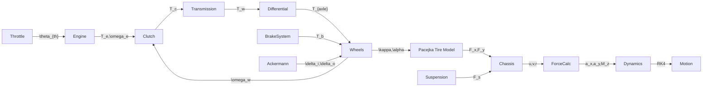
* **Engine** – accepts throttle position and produces engine torque
  `T_e = torqueCurve(RPM) \times u_{throttle}` limited by `maxTorque`.
* **Clutch** – transmits torque when engaged using
  `T_c = K_{clutch}(\omega_e - \omega_w)`.
* **Transmission** – multiplies clutch torque by the selected gear ratio and
  final drive: `T_w = T_c \times gearRatio \times finalDriveRatio`.
* **BrakeSystem** – converts brake pedal command to braking torque applied to
  the wheels.
* **LeafSpringSuspension** – generates suspension force
  `F_s = -K \Delta x - C v` from spring displacement and velocity.
* **AckermannGeometry** – maps steering wheel angle to left and right wheel
  angles for proper turning radii.
* **Pacejka96TireModel** – computes tire forces using the Pacejka formulas
  shown above for lateral and longitudinal grip.
* **HitchModel** – couples tractor and trailer with a spring‑damper torque and
  integrates the articulation angle with Runge–Kutta 4.

##### Interfaces
Each mechanical block acts as a black box with defined inputs and outputs:
- **Throttle** – input: pedal command `u_{th}`; output: throttle position
  `\theta_{th}`.
- **Engine** – input: `\theta_{th}`; output engine torque `T_e` as above.
- **Clutch** – input: engagement state, engine and wheel speeds;
  outputs transmitted torque `T_c`.
- **Transmission** – input: `T_c` and gear number; output wheel torque
  `T_w` and updated gear ratio.
- **BrakeSystem** – input: brake command `u_b`; output braking torque
  `T_b = u_b \times maxBrakingForce \times brakeEfficiency`.
- **LeafSpringSuspension** – inputs: spring deflection `\Delta x` and
  velocity `v`; output suspension force `F_s`.
- **AckermannGeometry** – input: desired steering angle `\delta`;
  outputs inner and outer wheel angles calculated via
  `\tan\delta_{i,o} = L/(R \mp W/2)` where `L` is wheelbase and
  `W` track width.
- **Pacejka96TireModel** – inputs: slip angle `\alpha`, slip ratio `\kappa`
  and normal load `F_z`; outputs lateral and longitudinal forces using the
  formulas above.
- **HitchModel** – inputs: tractor and trailer states; outputs hitch forces,
  moments and articulation angle integrated with RK4.

##### Detailed Block Descriptions
Each mechanical block can be viewed as a self contained subsystem described by
inputs, outputs and a short physical model.

###### Throttle
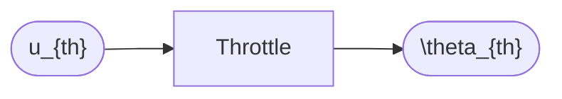
*Inputs*: driver command `u_{th}`
*Outputs*: opening angle `\theta_{th}`

The throttle filters the driver command and rate limits the change in opening.
The actual valve position is `\theta_{th}=\text{saturate}(u_{th})`. When the
clutch is disengaged the delivered opening becomes
`\theta_{adj}=\theta_{th}(1-e)` where `e` is the clutch engagement percentage.

###### Engine
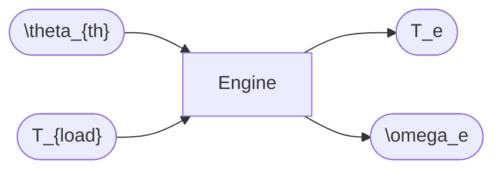
*Inputs*: `\theta_{th}`, load torque `T_{load}`
*Outputs*: engine torque `T_e`, engine speed `\omega_e`

Represents a diesel engine whose torque curve `T_e = f(\omega_e)` is measured
from test data. The instantaneous output is
`T_e = f(\omega_e)\,\theta_{th}` limited by `maxTorque`. Engine speed evolves as
`\dot{\omega}_e = (T_e - T_{load})/I_e` where `I_e` is engine inertia.

###### Clutch
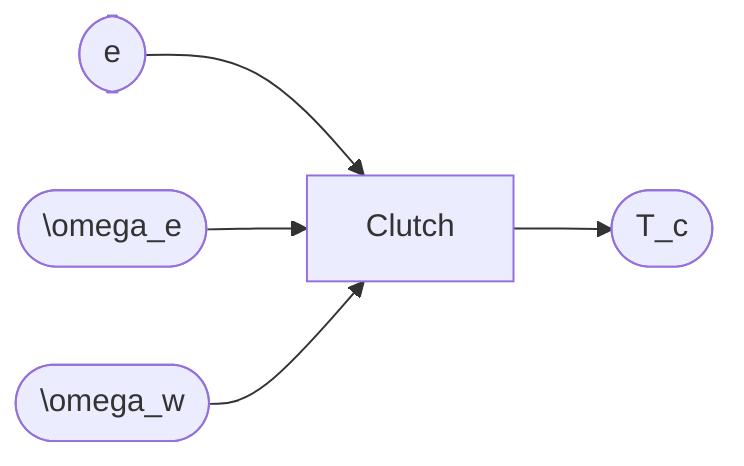
*Inputs*: engagement percentage `e`, engine and wheel speeds
*Outputs*: transmitted torque `T_c`

Torque transfer depends on clutch engagement:
`T_c = (1-e)\,T_{max}` with `T_{max}` the clutch capacity.

###### Transmission

*Inputs*: `T_c`, selected gear `g`
*Outputs*: wheel torque `T_w`

Wheel torque is amplified by the gear and final drive:
`T_w = T_c\,\text{gearRatio}(g)\,finalDrive`.

###### BrakeSystem
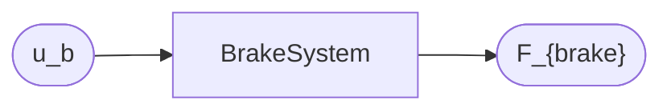
*Inputs*: brake command `u_b`
*Outputs*: braking force `F_{brake}`

Pedal command is converted to a total braking force via
`F_{brake}=u_b\,maxBrakingForce\,brakeEfficiency` which is then split between the
axles using the brake bias.

###### LeafSpringSuspension
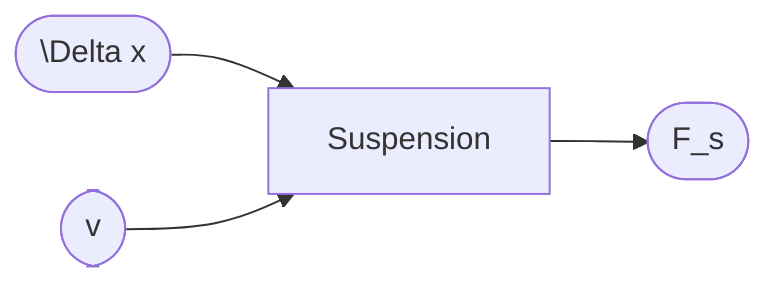
*Inputs*: spring deflection `\Delta x`, velocity `v`
*Outputs*: suspension force `F_s`

Suspension forces use a spring damper relation
`F_s=-K\,\Delta x-C\,v` and include load transfer from lateral/longitudinal
acceleration.

###### AckermannGeometry
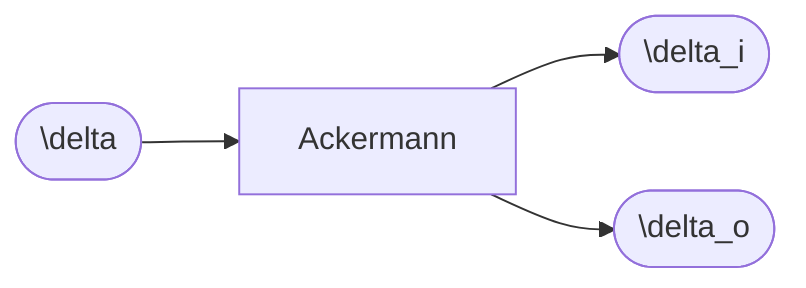
*Input*: desired steering angle `\delta`
*Outputs*: inner/outer wheel angles `\delta_i`,`\delta_o`

The geometry obeys
`\tan\delta_{i,o}=L/(R\mp W/2)` where `L` is wheelbase and `W` track width.

###### Pacejka96TireModel and PacejkaMagicFormula
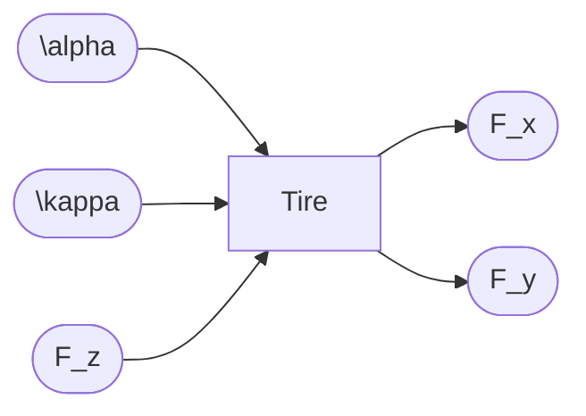
*Inputs*: slip angle `\alpha`, slip ratio `\kappa`, normal load `F_z`
*Outputs*: tire forces `F_x`,`F_y`

Both tire models implement the Pacejka equations to provide longitudinal and
lateral grip based on `\alpha` and `\kappa`.

###### HitchModel
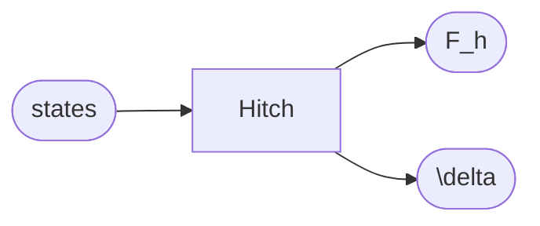
*Inputs*: tractor/trailer states
*Outputs*: hitch forces and articulation angle

The hitch applies a spring\–damper moment `M_h=k_h\,\delta+c_h\,\dot\delta`. The
angle `\delta` is integrated with RK4 together with trailer yaw rate.

### Interface Views
The following diagrams offer focused views of how signals travel through the
subsystems for different motion components.

#### Longitudinal Drive Chain
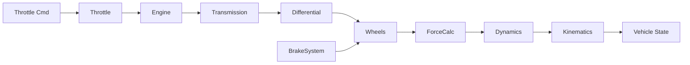

#### Steering and Hitch Chain
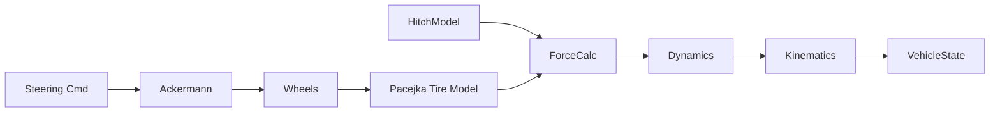

## Vehicle Modeling Flow
The following diagram summarizes how driver inputs propagate through the
mechanical subsystems to produce vehicle motion.

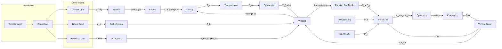

The labels show the key state variables exchanged between the blocks. For
example the engine produces torque `T_e = f(\omega_e)\,\theta_{th}` which the
transmission multiplies to `T_w = T_c\,\text{gearRatio}\,finalDrive`. Wheels
provide slip ratio `\kappa` and angle `\alpha` to the Pacejka tire model to
compute `F_x` and `F_y`. These forces together with the suspension reaction
`F_s` are summed by `ForceCalculator` yielding accelerations
`a_x`, `a_y` and yaw moment `M_z`. `DynamicsUpdater` integrates the resulting
rates with a Runge\--Kutta 4 step.

Each block corresponds to the components described above. Driver commands enter
on the left and the integrated vehicle state emerges on the right after the
dynamics calculations.

### Control Modules
Driver inputs are shaped by a set of controllers before reaching the mechanical blocks.  The figure below places the main control modules in context.

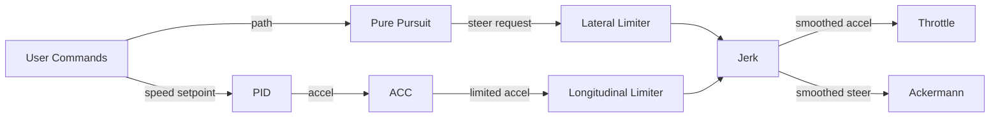

* **PID Speed Controller** computes acceleration using
  \(a = K_p e + K_i \int e\,dt + K_d\,\dot e\) where the error \(e\) is the
  difference between desired and filtered speed.  Cornering speed reduction is
  applied if the turn radius is small.
* **ACC Controller** modifies the PID output when approaching a curve.  When the
  distance to a curve is below \(v \times t_{lookahead}\) the commanded speed is
  reduced by a factor and jerk is limited to \(0.7 g\).
* **Pure Pursuit Path Follower** predicts waypoints ahead of the vehicle and
  computes the steering angle \(\delta = \tan^{-1}\frac{2L\sin\alpha}{d}\).  The
  angle passes through a Gaussian and low\-pass filter to reduce oscillations.
* **Longitudinal Limiter** reads calibration curves from Excel to cap allowable
  acceleration and braking as functions of speed.
* **Lateral Limiter** loads a steering limit curve from a file and clamps the
  requested wheel angle at high speed.
* **Jerk Controller** bounds the change of acceleration and steering rate using
  \(\Delta u_{max} = J_{max} \Delta t\).

These modules exchange commands with the mechanical subsystems in the vehicle
model diagram above.  They also use the filter chain described later to smooth
all signals.

The diagram below places the controllers around the mechanical drivetrain to
highlight how commands and feedback loop through the system.

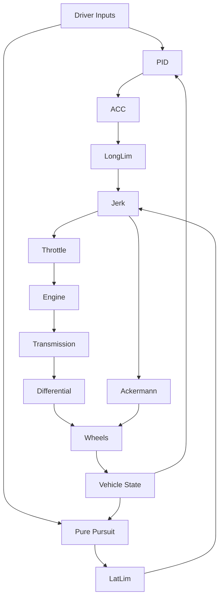

#### Control Limiters
Both steering and longitudinal actuation are limited according to speed
dependent curves.  The curves are provided as Excel files so they can be tuned
without modifying the code.

*Longitudinal limits*
```math
a_{cmd} = \mathrm{clip}\bigl( a_{des},\; a_{min}(v),\; a_{max}(v) \bigr)
```
Acceleration and braking bounds \(a_{max}(v)\) and \(a_{min}(v)\) are read from
`accelCurve.xlsx` and `decelCurve.xlsx`.  Desired acceleration is first passed
through a Gaussian filter and then ramped over several steps to avoid jerks.

*Lateral limits*
```math
\delta_{lim} = \mathrm{interp}(v, \text{speedData}, \text{maxAngleData})
```
`steerLimits.xlsx` contains pairs of vehicle speed and maximum steering angle.
The limiter clamps the requested angle to \(\pm\delta_{lim}\) each update.

### Tests
MATLAB test functions under `tests/` validate controllers, vehicle dynamics and localization routines. Run `runtests('tests')` inside MATLAB to execute all unit tests.

## Parameters
`VehicleModel.initializeDefaultParameters` exposes many tunable values. Key groups include:
- **Basic Configuration:** trailer inclusion, masses, initial velocity and inertia multipliers.
- **Geometry:** lengths, widths, center-of-gravity heights, wheelbase and track widths.
- **Tire & Suspension:** tire sizes, pressure matrices and spring/damping constants.
- **Engine & Transmission:** maximum torque, gear ratios, shift speeds and clutch behaviour.
- **Controllers:** PID gains, acceleration/steering limits and maximum speed.
- **Road & Environment:** slope angle, friction coefficient, aerodynamic drag and wind settings.

Example snippet:
```matlab
params.tractorMass = 8000;      % kg
params.trailerMass = 7000;      % kg
params.maxSpeed = 25.0;         % m/s speed limiter
params.Kp = 1.0;                % PID proportional gain
params.gearRatios = [14.94 11.21 8.31 6.26 ...];
```

### Full Parameter List
The table below summarises the most important configuration options. Each value
is loaded into the relevant mechanical block or controller at simulation start.

| Parameter | Description |
|-----------|-------------|
|`includeTrailer`|Enable trailer in the model|
|`tractorMass`, `trailerMass`|Vehicle and trailer mass in kilograms|
|`initialVelocity`|Starting speed (m/s)|
|`I_trailerMultiplier`|Scales trailer inertia|
|`maxDeltaDeg`|Maximum articulation angle|
|`dtMultiplier`|Time‑step scaling factor|
|`windowSize`|Moving‑average window for smoothing|
|`tractorLength`, `tractorWidth`, `tractorHeight`|Tractor body dimensions|
|`tractorCoGHeight`|Height of tractor centre of gravity|
|`tractorWheelbase`, `tractorTrackWidth`|Geometry affecting handling|
|`tractorNumAxles`, `tractorAxleSpacing`|Axle configuration|
|`numTiresPerAxleTractor`|Tires per axle on the tractor|
|`trailerLength`, `trailerWidth`, `trailerHeight`|Trailer body dimensions|
|`trailerCoGHeight`|Trailer centre of gravity height|
|`trailerWheelbase`, `trailerTrackWidth`|Trailer geometry|
|`trailerAxlesPerBox`|Axle count for each trailer box|
|`trailerNumAxles`, `trailerNumBoxes`|Total axles and boxes|
|`trailerAxleSpacing`|Spacing between trailer axles|
|`trailerHitchDistance`, `tractorHitchDistance`|Hitch points|
|`numTiresPerAxleTrailer`|Tires per axle on the trailer|
|`maxSteeringAngleAtZeroSpeed`|Steering angle limit at standstill|
|`steeringCurveFilePath`|Excel file with steering limits|
|`maxSteeringSpeed`|Speed above which steering is limited|
|`minAccelAtMaxSpeed`, `minDecelAtMaxSpeed`|Acceleration bounds|
|`accelCurveFilePath`, `decelCurveFilePath`|Excel curves for the limiter|
|`maxSpeedForAccelLimiting`|Upper speed for limiter lookup|
|`Kp`, `Ki`, `Kd`|PID gains for speed control|
|`lambda1Accel`, `lambda2Accel`, `lambda1Vel`, `lambda2Vel`, `lambda1Jerk`, `lambda2Jerk`|Levant differentiator parameters|
|`enableSpeedController`|Toggle PID controller|
|`maxSpeed`|Hard speed limit (m/s)|
|`tractorTireHeight`, `tractorTireWidth`|Tire dimensions|
|`trailerTireHeight`, `trailerTireWidth`|Trailer tire dimensions|
|`airDensity`, `dragCoeff`|Aerodynamic coefficients|
|`slopeAngle`, `roadFrictionCoefficient`|Road grade and friction|
|`roadSurfaceType`, `roadRoughness`|Surface description|
|`K_spring`, `C_damping`, `restLength`|Suspension properties|
|`windSpeed`, `windAngleDeg`|Ambient wind settings|
|`brakingForce`, `brakeEfficiency`, `brakeBias`, `brakeType`, `maxBrakingForce`|Brake system setup|
|`maxGear`, `gearRatios`, `finalDriveRatio`|Transmission configuration|
|`shiftUpSpeed`, `shiftDownSpeed`, `engineBrakeTorque`, `shiftDelay`|Shift logic|
|`flatTireIndices`|Indices of tires that fail during run|
|`vehicleType`|Preset for vehicle style|
|`steeringCommands`, `accelerationCommands`, `tirePressureCommands`|Command scripts executed over time|
|`torqueFileName`|Excel file with engine torque curve|
|`maxClutchTorque`, `engagementSpeed`, `disengagementSpeed`|Clutch behaviour|
|`mapCommands`, `waypoints`|Track layout|

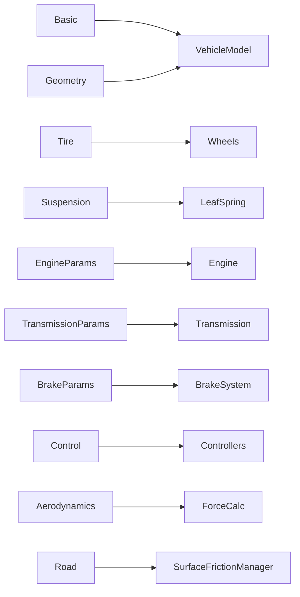

### GUI Tabs and Inputs
`VehicleGUIManager` organises parameters across multiple configuration tabs.  At
run time these settings are written into `VehicleModel` and its controllers as
shown below.

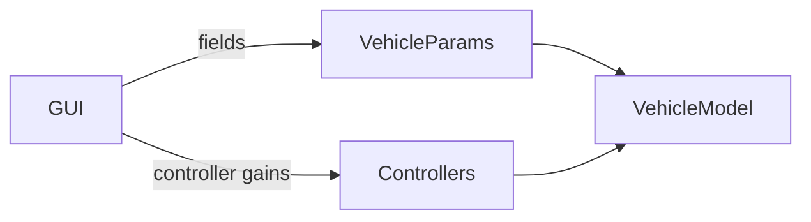

Key tabs include:

- **Basic Configuration** – masses, inclusion of a trailer and log options.
- **Control Limits** – upload Excel curves for steering and acceleration
  limiters and tune ramping windows.
- **PID Controller** – set gains and jerk limits for speed tracking.
- **Tires & Suspension** – define tire pressures, spring rates and damping.
- **Engine/Transmission** – torque curves, gear ratios and shift logic.
- **Path Follower** – waypoints and lookahead distance for pure pursuit.
- **Commands** – steering, throttle and tire pressure scripts executed during a
  run.

Changing any of these fields immediately updates the parameters used in the next
simulation step, enabling rapid calibration of the entire vehicle model.

## Capabilities
- Simulate two vehicles with optional trailers in parallel.
- Detect and report collisions and severity metrics.
- Visualize runs in 2‑D or 3‑D including articulated trailers.
- Export logs and configurations to XML, CSV, MAT and PNG files.
- Generate lane maps on the fly from command strings.

## Architecture Diagram
```
[UIManager] <-> [SimManager] <-> [VehicleModel] <-> [Physics & Mechanics]
       |                         |
   [PlotManager]            [Map / Localizer]
```

## Getting Help
Use `help <FunctionName>` inside MATLAB for detailed function comments. Example runs are provided in the `Simulations` folder. The `Scripts` directory contains helper utilities for building MEX files and running batch jobs.

## License
This project is licensed under the GNU General Public License v3. See the [LICENSE](LICENSE) file for details.

## Command Inputs and Track Generation
`VehicleModel` exposes several command strings to automate test cases:
- **`mapCommands`** – a `|` separated list describing lane segments.
  - `straight(x1,y1,x2,y2)` adds a straight from `(x1,y1)` to `(x2,y2)`.
  - `curve(cx,cy,r,theta1,theta2,dir)` adds an arc around `(cx,cy)` with radius `r` from `theta1` to `theta2` degrees. `dir` is `cw` or `ccw`.
  - Example:
    ```matlab
    params.mapCommands = "straight(100,200,300,200)|curve(300,250,50,270,90,ccw)";
    map = LaneMap(400,400);
    map = map.processLaneCommands(params.mapCommands);
    map.plotLaneMapWithCommands(gca, params.mapCommands, 'k');
    ```
- **`steeringCommands` / `accelerationCommands`** – sequences like `"time angle; ..."` or `"time accel; ..."` that set steering angles or throttle percentages at specific times. These strings are interpreted by `VehicleGUIManager` and forwarded to controllers.
- **`tirePressureCommands`** – adjusts individual tire pressures during a run.
- **`flatTireIndices`** – vector of tire indices that should fail. `ForceCalculator` reduces Pacejka stiffness and friction for these wheels, effectively simulating a blow‑out.

## Collision Analysis
`VehicleCollisionSeverity` estimates delta‑V values using SAE&nbsp;J2980 tables. For heavy trucks the thresholds scale with kinetic energy:
```matlab
scale = sqrt(J2980AssumedMaxMass / vehicleMass);
thresholds = baseDV * scale;  % baseDV from J2980 table
```
Collision energy is computed as `0.5 * m * \Delta v^2` and compared with severity thresholds. This extension allows comparing truck crashes against J2980 passenger‑car limits by specifying `J2980AssumedMaxMass` in the GUI.

## Physics Models
The blocks above are tied together using classical vehicle dynamics. The process
for each simulation step is summarized below.

1. **Slip and Tire Forces**
   - Slip ratio: `\kappa = (\omega R - v_x)/\max(v_x,0.1)`
   - Slip angle: `\alpha = \tan^{-1}(v_y / |v_x|)`
   - Pacejka '96 formula gives the tire forces:
     `F_x = D_x \sin(C_x \tan^{-1}(B_x \kappa - E_x(B_x \kappa - \tan^{-1}(B_x \kappa))))`
     `F_y = D_y \sin(C_y \tan^{-1}(B_y \alpha - E_y(B_y \alpha - \tan^{-1}(B_y \alpha))))`

2. **Force Summation**
   - Aerodynamic drag: `F_d = 0.5\,\rho\,C_d\,A\,v^2`
   - Wheel force: `F_x = T_w/R_w - F_{brake} - F_d`
   - Net lateral force combines tire and suspension reactions.
   - Yaw moment: `M_z = l_f F_{yf} - l_r F_{yr}`

3. **Dynamics Update**
   - Longitudinal: `\frac{du}{dt} = F_x/m + r v`
   - Lateral: `\frac{dv}{dt} = F_y/m - r u`
   - Yaw: `\dot r = M_z / I_z`
   - `KinematicsCalculator` maps body velocities to global rates.

4. **RK4 Integration**
   Accelerations are integrated with `DynamicsUpdater.updateStateRK4`:
   ```
   k1 = f(y)
   k2 = f(y + dt/2 * k1)
   k3 = f(y + dt/2 * k2)
   k4 = f(y + dt * k3)
   y_{n+1} = y_n + dt/6 * (k1 + 2*k2 + 2*k3 + k4)
   ```

5. **Energy Balance**
   Collision analysis uses `E_k = 0.5 \, m \, v^2` to compare against severity
   thresholds.

This chain transforms driver inputs into forces and accelerations that are
integrated to update position, orientation and velocity every time step.

## Physics
The simulator's physics engine combines kinematic relationships with rigid-body
dynamics. Key formulas include:

### Kinematics
- Distance under constant acceleration:
  `s = v_0 t + 0.5 a t^2`
- Final velocity:
  `v = v_0 + a t`
- Rotation matrix from body to world given roll `\phi`, pitch `\theta` and yaw
  `\psi`:
  `R = R_z(\psi) R_y(\theta) R_x(\phi)`.
- Body velocities to world-frame position rates:
  `\dot x = u \cos\psi - v \sin\psi`,
  `\dot y = u \sin\psi + v \cos\psi`.
- Lateral acceleration update:
  `a_{lat} = F_y / m`
- Roll dynamics internal to `KinematicsCalculator`:
  `rollAccel = (M_{roll} - D_{roll} \, rollRate - K_{roll} \, rollAngle) / I_{roll}`

### Dynamics
- Longitudinal motion:
  `\frac{du}{dt} = F_x/m + r v`
- Lateral motion:
  `\frac{dv}{dt} = F_y/m - r u`
- Yaw rate derivative:
  `\dot r = M_z / I_z`
- Roll rate derivative:
  `\dot p = (momentRoll - m g h \sin\phi - K_{roll}\phi - C_{roll} p) / I_{xx}`
- Tire slip ratio:
  `\kappa = (\omega R - v_x)/\max(v_x,0.1)`
- Tire slip angle:
  `\alpha = \tan^{-1}(v_y / |v_x|)`
- Aerodynamic drag:
  `F_d = 0.5\,\rho\,C_d\,A\,v^2`
- Net longitudinal force: `F_x = T_w/R_w - F_{brake} - F_d`
- Translational kinetic energy: `E_{trans} = 0.5\,m\,(u^2 + v^2)`
- Rotational kinetic energy: `E_{rot} = 0.5\,I\,\omega^2`
- Yaw moment from tire forces: `M_z = l_f F_{yf} - l_r F_{yr}`
- Newton's second law couples the forces and accelerations as
  `m\,a = \sum F` and `I\,\alpha = \sum M` for translational and rotational
  dynamics.

### Integration
Vehicle states are propagated using a classical fourth‑order Runge–Kutta (RK4)
scheme implemented in `DynamicsUpdater.updateStateRK4` and `HitchModel`:
```
k1 = f(y)
k2 = f(y + dt/2 * k1)
k3 = f(y + dt/2 * k2)
k4 = f(y + dt * k3)
y_{n+1} = y_n + dt/6 * (k1 + 2*k2 + 2*k3 + k4)
```
This integration is applied to both translational and rotational equations of
motion every simulation step.
`ForceCalculator` first determines the net force and moment acting on the
vehicle from tire grip, braking torque, aerodynamic drag, suspension reaction
and hitch constraints. `DynamicsUpdater.stateDerivative` converts these forces
into linear and angular accelerations:
`a_x=F_x/m`, `a_y=F_y/m` and `\dot r=M_z/I_z`. `KinematicsCalculator`
then maps body velocities to world-frame position rates. The RK4 loop integrates
these derivatives so that position, velocity, orientation and roll state are
all updated consistently each time step.
The dynamic equations determine the accelerations from forces, while the kinematic relations map these accelerations to changes in position and orientation. The RK4 integrator couples them so that forces acting on the vehicle directly influence its motion each timestep.

## Signal Filtering
The simulator applies several filters to commands and forces so that abrupt
changes do not destabilize the dynamics. The sequence for each signal is shown
below.

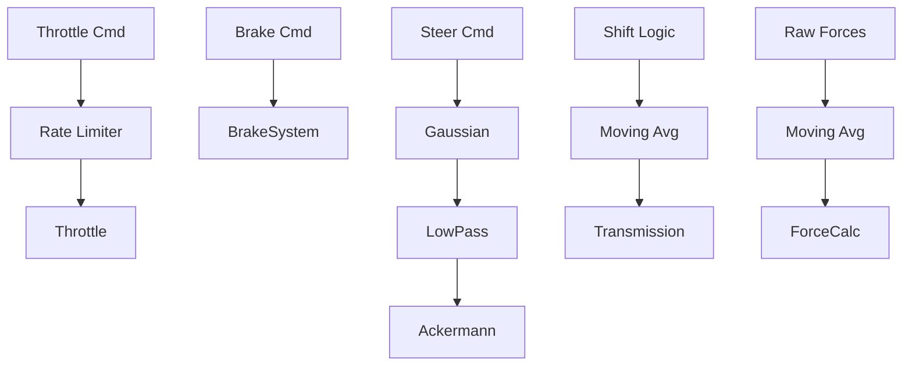

- **Rate limiter** inside `Throttle` gradually applies driver throttle commands.
- **Moving average filters** smooth gear shifting signals and the forces returned
  by `ForceCalculator`.
- **Gaussian filter** followed by a **low‑pass filter** cleans the steering angle
  computed in `purePursuit_PathFollower`.

These filters act every step in the order shown to yield smoother actuation and
more stable simulations.

The mathematical form of each filter is:

- **Rate limiter**
  \[ y_k = \min(\max(x_k, y_{k-1}-r_{\max} \Delta t),\; y_{k-1}+r_{\max} \Delta t) \]
  with rate limit \(r_{\max}\).
- **Gaussian filter**
  \[ y_k = \sum_{i=-n}^{n} w_i x_{k-i} \] where \(w_i\) are normalised Gaussian weights.
- **Moving average**
  \[ y_k = \tfrac{1}{N} \sum_{i=0}^{N-1} x_{k-i} \]
- **Low-pass filter**
  \[ y_k = \alpha x_k + (1-\alpha) y_{k-1} \]

Tuning parameters like \(r_{\max}\), window size \(N\) and coefficient \(\alpha\)
are exposed in the GUI tabs so users can calibrate how aggressively commands are
smoothed.
