# VDSS - Vehicle Dynamics Safety Simulator
Author: Miguel Marina <karel.capek.robotics@gmail.com> - [LinkedIn](https://www.linkedin.com/in/progman32/)

## Overview
VDSS provides a MATLAB based environment for simulating vehicle dynamics and safety scenarios. The top level `VDSS` function sets up the user interface, loads vehicle configurations and executes simulations through the `SimManager` class. The design follows a modular approach where each toolbox encapsulates a specific subsystem (e.g., controls, physics, plotting). Users can modify parameters or replace components without rewriting the entire simulator.

## Quick Start
1. Open MATLAB and add this repository to the path with `addpath(genpath(pwd))`.
2. Run `VDSS` to launch the graphical interface and start a default simulation.
3. Use the menu options to load vehicle parameter files, start/stop runs and save results.

## Table of Contents
- [Directory Structure](#directory-structure)
- [Configuration Files](#configuration-files)
- [Toolboxes](#toolboxes)
- [Mechanics](#mechanics)
- [Mechanical Model Blocks](#mechanical-model-blocks)
- [Physics Models](#physics-models)
- [Physics](#physics)
- [J2980 Extension for Heavy Vehicles](#j2980-extension-for-heavy-vehicles)
- [Collision Severity Determination](#collision-severity-determination)
- [Simulation Output Files](#simulation-output-files)
- [Plotting and Data Interpretation](#plotting-and-data-interpretation)

## Directory Structure
- `Source/` – MATLAB toolboxes that implement the simulator.
- `Scripts/` – Utility scripts and MEX wrappers.
- `Curves/` – Acceleration, braking and steering profiles used by the controllers.
- `tests/` – Unit tests for core algorithms.
- `codegen/` – Generated binaries when MEX wrappers are built.
- `VDSS.m` – Entry point that constructs the GUI and orchestrates components.

## Configuration Files
Vehicle behaviour is largely defined through user editable spreadsheets
and XML configuration files:

- `Curves/*_torque_curve.xlsx` – engine torque maps used by `Engine`.
- `Curves/*_AccelCurve.xlsx` – maximum acceleration limits.
- `Curves/*_DecelCurve.xlsx` – braking deceleration limits.
- `Curves/*_SteeringCurve.xlsx` – steering angle limits versus speed.

Provide your own versions of these files to model different engines,
brake systems, steering responses or transmissions.  The repository
includes sample spreadsheets illustrating the expected layout:

| File | Purpose | Example entries |
| ---- | ------- | --------------- |
| `Curves/sedan_torque_curve.xlsx` | Engine torque map (RPM vs Nm). | `800\t80`, `1000\t100`, `1200\t120` |
| `Curves/sedan_AccelCurve.xlsx` | Max acceleration by speed (m/s vs m/s²). | `0\t3`, `1\t2.9`, `2\t2.8` |
| `Curves/sedan_DecelCurve.xlsx` | Max braking decel by speed (m/s vs m/s²). | `0\t-2.4`, `1\t-2.2`, `2\t-2.0` |
| `Curves/sedan_SteeringCurve.xlsx` | Steering limits (m/s vs deg). | `0\t35`, `5\t30`, `10\t25` |
| `Class8Truck_And_Sedan_CollisionFrontEnd.xml` | Sample heavy vehicle setup with gear ratios, masses and waypoints. | `<tractorMass>9070</tractorMass>` |

## Toolboxes
### Plotting
`PlotManager` and `VehiclePlotter` create figures, animate trajectories and manage overlays. Typical use is:
```matlab
pm = PlotManager();
pm.createFigure('Position', [100 100 800 600]);
VehiclePlotter.plotVehicle(pm, vehicleState);
```
The plots update in real time as the simulation runs.

### GUI
`UIManager` builds the main window and configuration tabs while `DataManager` stores simulation data shared across modules. Widgets allow editing parameters live and displaying simulation status.

### Vehicle Model
`VehicleModel` aggregates all controllers and mechanical subsystems. `VehicleParameters` defines default masses and geometry. `VehicleGUIManager` links GUI widgets to model fields. A vehicle instance is assembled from building blocks like engine, transmission, suspension and tire objects. Relationships among components are shown below:
```
[Engine] --torque--> [Transmission] --force--> [Tires] --grip--> [Chassis]
```

### Simulation
`SimManager` orchestrates vehicle instances, runs the physics engine and handles collision detection. Time integration occurs inside `runStep`, which updates every vehicle and the 3‑D world.

### Mapping
`LaneMap` holds waypoint data and `VehicleLocalizer` computes curvature for path following. Maps can be generated programmatically using `mapCommands` strings or loaded from CSV files.

### Configuration
`ConfigurationManager` saves and loads XML configurations and simulation results. Each configuration captures parameter sets, map commands and run logs for later replay.

### Physics
Includes `KinematicsCalculator`, `ForceCalculator`, `DynamicsUpdater`, `CollisionDetector`, `VehicleCollisionSeverity`, `SurfaceFrictionManager` and `StabilityChecker`. These functions can be compiled to MEX for faster execution via `Scripts/Wrappers/generate_mex`. Key equations:
- Wheel slip ratio: $\kappa = (\omega R - v_x) / \max(v_x, 0.1)$
- Parameters:
  - $\omega$ – wheel angular speed (rad/s)
  - $R$ – tire radius (m)
  - $v_x$ – longitudinal vehicle speed (m/s)
- Lateral slip angle: $\alpha = \tan^{-1}(v_y / |v_x|)$
- Parameters:
  - $v_y$ – lateral vehicle speed (m/s)
  - $v_x$ – longitudinal vehicle speed (m/s)
- Aerodynamic drag: $F_d = 0.5 \times C_d \times A \times \rho \times v^2$
- Parameters:
  - $C_d$ – drag coefficient
  - $A$ – frontal area (m²)
  - $\rho$ – air density (kg/m³)
  - $v$ – vehicle speed (m/s)

### Graphics
Objects such as `Vehicle3D`, `Road3D` and `World3D` render 3‑D scenes for the optional `Sim3DAnimator`. Screenshots may be saved automatically at each frame for later video generation.

### Mechanics
Contains drivetrain and suspension models (`Engine`, `Transmission`, `BrakeSystem`, `Clutch`, `LeafSpringSuspension`, `Pacejka96TireModel`, etc.). The tire model uses the Pacejka 1996 formula:
$F_y = D \times \sin\bigl(C \times \tan^{-1}(B\alpha - E(B\alpha - \tan^{-1}(B\alpha)))\bigr)$
Parameters:
  - $B$ – stiffness factor
  - $C$ – shape factor
  - $D$ – peak factor
  - $E$ – curvature factor
  - $\alpha$ – slip angle (rad)
where `B`, `C`, `D` and `E` are stiffness parameters.

#### Mechanical Model Blocks
The main mechanical components behave like interconnected black boxes with clear
inputs and outputs. Their relationships can be visualized using Mermaid:
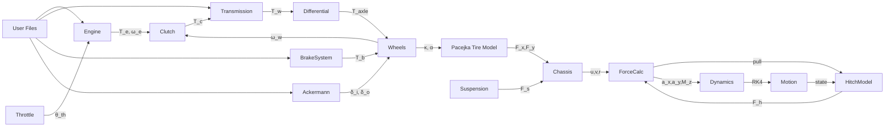
* **Engine** – accepts throttle position and produces engine torque
$T_e = T_{curve}(\omega_e) \times \theta_{th}$
- Parameters:
  - $\omega_e$ – engine speed (rad/s)
  - $T_{curve}(\omega_e)$ – torque curve evaluated at $\omega_e$
  - $\theta_{th}$ – throttle opening fraction
  limited by `maxTorque`.
* **Clutch** – transmits torque when engaged using
$T_c = K_{clutch} \times (\omega_e - \omega_w)$
- Parameters:
  - $K_{clutch}$ – clutch stiffness
  - $\omega_e$ – engine speed (rad/s)
  - $\omega_w$ – wheel speed (rad/s)
* **Transmission** – multiplies clutch torque by the selected gear ratio and
  final drive:
$T_w = T_c \times gearRatio \times finalDriveRatio$
- Parameters:
  - $T_c$ – clutch torque (N·m)
  - $gearRatio$ – selected gear ratio
  - $finalDriveRatio$ – final drive ratio
* **BrakeSystem** – converts the brake pedal command into braking torque
  applied to the wheels.
$F_{brake} = u_b \times \mathrm{maxBrakingForce} \times \mathrm{brakeEfficiency}$
- Parameters:
  - $u_b$ – brake pedal command (0‑1)
  - $\mathrm{maxBrakingForce}$ – maximum brake force (N)
  - $\mathrm{brakeEfficiency}$ – efficiency factor
  The resulting force is distributed between the axles according to the
  brake bias.
* **LeafSpringSuspension** – generates suspension force
$F_s = -K \times \Delta x - C \times v$
- Parameters:
  - $K$ – spring stiffness (N/m)
  - $\Delta x$ – spring displacement (m)
  - $C$ – damping coefficient (N·s/m)
  - $v$ – relative velocity (m/s)
  from spring displacement and velocity.
* **AckermannGeometry** – maps steering wheel angle to left and right wheel
  angles for proper turning radii.
* **Pacejka96TireModel** – computes tire forces using the Pacejka formulas
  shown above for lateral and longitudinal grip.
* **HitchModel** – couples tractor and trailer with a spring‑damper torque and
  integrates the articulation angle with Runge–Kutta 4.

##### Interfaces
Each mechanical block acts as a black box with defined inputs and outputs:
- **Throttle** – input: pedal command `u_th`; output: throttle position
  $\theta_{th}$.
- **Engine** – inputs: throttle angle $\theta_{th}$ and load torque $T_{load}$;
  outputs engine torque $T_e$ and engine speed $\omega_e$.
- **Clutch** – inputs: engagement percentage $e$, engine speed $\omega_e$ and
  wheel speed $\omega_w$; output transmitted torque $T_c$.
- **Transmission** – inputs: clutch torque $T_c$ and selected gear $g$;
  output wheel torque $T_w$.
- **BrakeSystem** – input: brake command `u_b`; output braking torque
  $T_b = u_b \times \mathrm{maxBrakingForce} \times \mathrm{brakeEfficiency}$
 - **LeafSpringSuspension** – inputs: vertical displacement $\Delta x$, vertical
   velocity $v$, lateral acceleration $a_y$, longitudinal acceleration $a_x$,
   moment arm and current wheel load; output suspension force $F_s$.
- **AckermannGeometry** – input: desired steering angle $\delta$;
  outputs inner and outer wheel angles calculated via
  $\tan\delta_{i,o} = \tfrac{L}{R \mp W/2}$ where `L` is wheelbase and
  `W` track width.
  - Parameters:
    - $L$ – wheelbase (m)
    - $R$ – turning radius (m)
    - $W$ – track width (m)
    - $\delta$ – commanded steering angle (rad)
- **Pacejka96TireModel** – inputs: slip angle $\alpha$, slip ratio $\kappa$
  and normal load $F_z$; outputs lateral and longitudinal forces using the
  formulas above.
  - **HitchModel** – inputs: full tractor and trailer state structures
    (positions, orientations, linear and angular velocities) plus the applied
    pulling force; outputs hitch forces, moments and the articulation angle
    integrated with RK4.

##### Detailed Block Descriptions
Each mechanical block can be viewed as a self contained subsystem described by
inputs, outputs and a short physical model.

###### Throttle
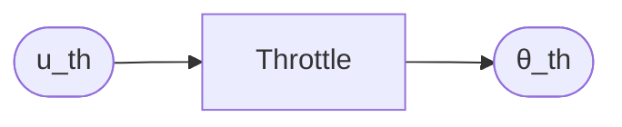
*Inputs*: driver command `u_th`
*Outputs*: opening angle $\theta_{th}$

The throttle filters the driver command and rate limits the change in opening.
The actual valve position is computed via a saturation nonlinearity:
$\theta_{th} = \mathrm{sat}(u_th)$
When the
clutch is disengaged the delivered opening becomes
$\theta_{adj}=\theta_{th}(1-e)$ where `e` is the clutch engagement percentage.

###### Engine
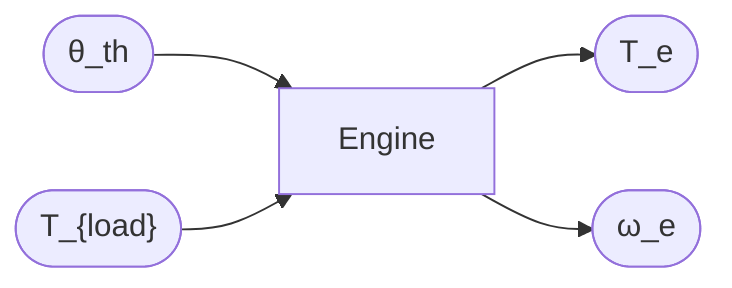
*Inputs*: $\theta_{th}$, load torque $T_{load}$
*Outputs*: engine torque $T_e$, engine speed $\omega_e$

Represents a diesel engine whose torque curve $T_e = f(\omega_e)$ is measured
from test data. The instantaneous output is
$T_e = f(\omega_e) \times \theta_{th}$ limited by `maxTorque`. Engine speed evolves as
ω̇ₑ = (Tₑ - T_load) / Iₑ where `I_e` is engine inertia.

Related parameters: [`maxEngineTorque`](#param-maxEngineTorque), [`maxPower`](#param-maxPower), [`idleRPM`](#param-idleRPM), [`redlineRPM`](#param-redlineRPM), [`torqueFileName`](#param-torqueFileName)

###### Clutch
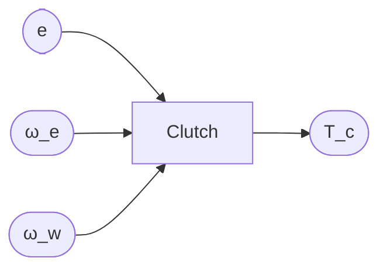
*Inputs*: engagement percentage `e`, engine and wheel speeds
*Outputs*: transmitted torque $T_c$

Torque transfer depends on clutch engagement:
$T_c = (1-e) \times T_{max}$ with `T_{max}` the clutch capacity.

Related parameters: [`maxClutchTorque`](#param-maxClutchTorque), [`engagementSpeed`](#param-engagementSpeed), [`disengagementSpeed`](#param-disengagementSpeed)

###### Transmission
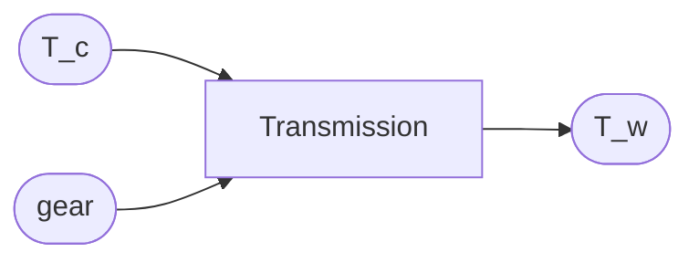
*Inputs*: $T_c$, selected gear `g`
*Outputs*: wheel torque $T_w$

Wheel torque is amplified by the gear and final drive:
$T_w = T_c \times \mathrm{gearRatio}(g) \times finalDrive$

Related parameters: [`gearRatios`](#param-gearRatios), [`finalDriveRatio`](#param-finalDriveRatio), [`maxGear`](#param-maxGear), [`shiftUpSpeed`](#param-shiftUpSpeed), [`shiftDownSpeed`](#param-shiftDownSpeed), [`shiftDelay`](#param-shiftDelay)

###### BrakeSystem

*Inputs*: brake command `u_b`
*Outputs*: braking force $F_{brake}$

The pedal command (u_b) is mapped to the total braking force:
$F_{brake} = u_b \times \mathrm{maxBrakingForce} \times \mathrm{brakeEfficiency}$
This force is then split between the axles according to the brake bias.

Related parameters: [`maxBrakingForce`](#param-maxBrakingForce), [`brakingForce`](#param-brakingForce), [`brakeEfficiency`](#param-brakeEfficiency), [`brakeBias`](#param-brakeBias), [`brakeType`](#param-brakeType)

###### LeafSpringSuspension
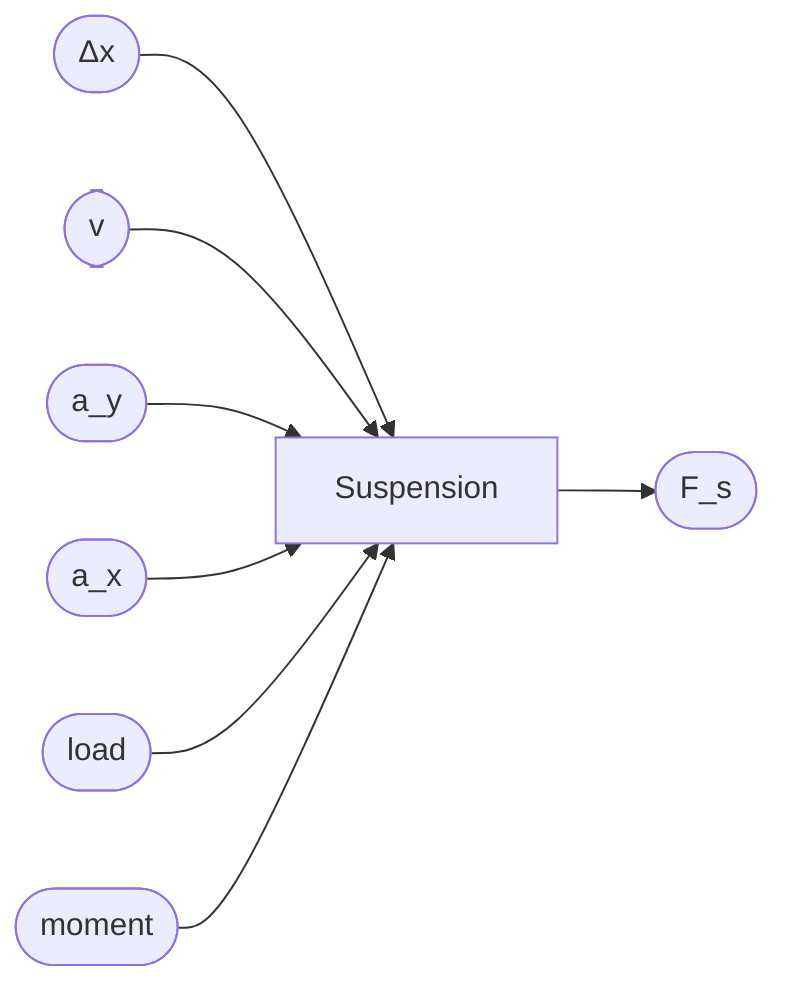
*Inputs*: vertical displacement $\Delta x$, vertical velocity `v`, lateral
acceleration $a_y$, longitudinal acceleration $a_x$, moment arm and current
wheel load
*Outputs*: suspension force $F_s$

Suspension forces use a spring damper relation
$F_s = -K \times \Delta x - C \times v$ and include load transfer from lateral/longitudinal
acceleration.

Related parameters: [`K_spring`](#param-K_spring), [`C_damping`](#param-C_damping), [`restLength`](#param-restLength)

###### AckermannGeometry
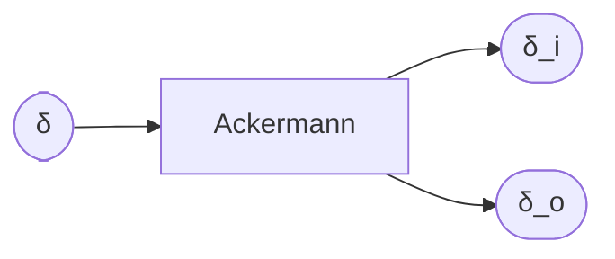
*Input*: desired steering angle $\delta$
*Outputs*: inner/outer wheel angles $\delta_i$, $\delta_o$

The geometry obeys
$\tan\delta_{i,o} = \tfrac{L}{R \mp W/2}$ where `L` is wheelbase and `W` track width.

###### Pacejka96TireModel and PacejkaMagicFormula
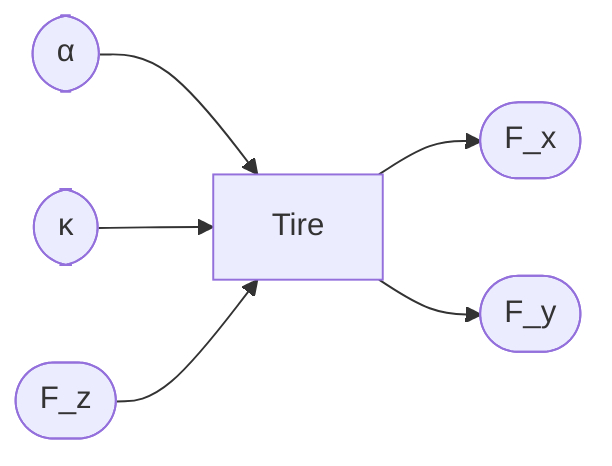
*Inputs*: slip angle $\alpha$, slip ratio $\kappa$, normal load $F_z$
*Outputs*: tire forces $F_x$, $F_y$

Both tire models implement the Pacejka equations to provide longitudinal and
 lateral grip based on $\alpha$ and $\kappa$.

Related parameters: [`pCx1..pKy3`](#param-pacejka), [`tractorTireHeight`](#param-tractorTireHeight), [`tractorTireWidth`](#param-tractorTireWidth), [`trailerTireHeight`](#param-trailerTireHeight), [`trailerTireWidth`](#param-trailerTireWidth)

###### HitchModel
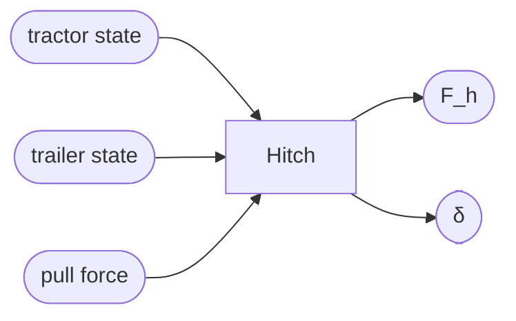
*Inputs*: tractor and trailer states with position, orientation and velocity
components, along with the longitudinal pulling force
*Outputs*: hitch forces and articulation angle

The hitch imposes a rotational spring\–damper torque
$M_h = k_h \times \delta + c_h \times \dot\delta$
Parameters:
  - $k_h$ – hitch spring constant (N·m/rad)
  - $c_h$ – hitch damping constant (N·m·s/rad)
  - $\delta$ – articulation angle between tractor and trailer (rad)
  - $\dot\delta$ – articulation rate (rad/s)
where $\delta$ is the articulation angle between tractor and trailer.
`HitchModel` integrates this angle with the same Runge\--Kutta 4 scheme used for
the trailer yaw rate.

###### Vehicle State Structure
The term *vehicle state* refers to a structure created by `DynamicsUpdater`
and passed to `ForceCalculator`, `HitchModel` and other physics modules. Its
main fields are:

| Field | Description |
|-------|-------------|
| `position` | `[x, y, z]` global location of the center of gravity (m) |
| `orientation` | `[roll, pitch, yaw]` angles in radians |
| `velocity` | `[u, v, w]` body-frame linear velocities (m/s) |
| `angularVelocity` | `[p, q, r]` body-frame angular rates (rad/s) |
| `trailerVelocity` | Trailer linear velocity vector when present |
| `trailerAngularVelocity` | Trailer angular velocity vector |
| `lateralAcceleration` | Lateral acceleration $a_y$ (m/s²) |
| `longitudinalAcceleration` | Longitudinal acceleration $a_x$ (m/s²) |

These variables summarize the instantaneous motion of both tractor and trailer
and serve as the inputs for computing tire forces, hitch loads and stability
metrics.

Related parameters: [`trailerHitchDistance`](#param-trailerHitchDistance), [`tractorHitchDistance`](#param-tractorHitchDistance), [`maxDeltaDeg`](#param-maxDeltaDeg), [`I_trailerMultiplier`](#param-I_trailerMultiplier)

### Interface Views
The following diagrams offer focused views of how signals travel through the
subsystems for different motion components.

#### Longitudinal Drive Chain
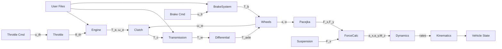

#### Steering and Hitch Chain
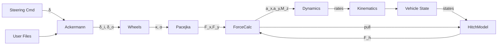

## Vehicle Modeling Flow
The following diagram summarizes how driver inputs propagate through the
mechanical subsystems to produce vehicle motion.

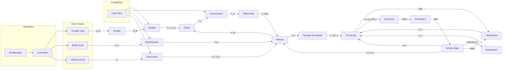

The labels show the key state variables exchanged between the blocks. For
example the engine produces torque $T_e = f(\omega_e) \times \theta_{th}$ which the
transmission multiplies to
$T_w = T_c \times \mathrm{gearRatio} \times finalDrive$
Wheels
provide slip ratio `$\kappa$` and angle `\alpha` to the Pacejka tire model to
compute `F_x` and `F_y`. These forces together with the suspension reaction
`F_s` are summed by `ForceCalculator` yielding accelerations
`a_x`, `a_y` and yaw moment `M_z`. `DynamicsUpdater` integrates the resulting
rates with a Runge\--Kutta 4 step.

Each block corresponds to the components described above. Driver commands enter
on the left and the integrated vehicle state emerges on the right after the
dynamics calculations.

### Control Modules
Driver inputs are shaped by a set of controllers before reaching the mechanical blocks.  The figure below places the main control modules in context.

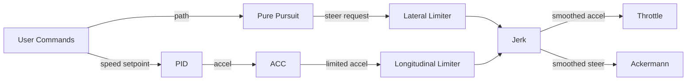

* **PID Speed Controller** computes acceleration using
  $a = K_p \times e + K_i \int e\,dt + K_d \times \dot e$ where the error $e$ is the
  Parameters:
  - $K_p$ – proportional gain
  - $K_i$ – integral gain
  - $K_d$ – derivative gain
  - $e$ – speed error (m/s)
  The difference between desired and filtered speed.  Cornering speed reduction is
  applied if the turn radius is small.
* **ACC Controller** modifies the PID output when approaching a curve.  When the
  distance to a curve is below $v \times t_{lookahead}$ the commanded speed is
  reduced by a factor and jerk is limited to $0.7 g$.
  * **Pure Pursuit Path Follower** predicts a lookahead pose using
  $\hat{\theta} = \theta + \tfrac{v}{L}\tan(\delta) t_p$ and
  $\hat{p} = p + v t_p[\cos\hat{\theta}, \sin\hat{\theta}]$. It searches the
  path ahead for a target point.  The heading error is
  Parameters:
  - $\theta$ – current heading (rad)
  - $v$ – vehicle speed (m/s)
  - $L$ – wheelbase (m)
  - $\delta$ – steering angle (rad)
  - $t_p$ – prediction time (s)
  - $p$ – current position vector
  - $\hat{\theta}$ – predicted heading
  - $\hat{p}$ – predicted position

α = atan2(yₗ - p̂_y, xₗ - p̂_x) - θ̂
  Parameters:
  - $y_l, x_l$ – coordinates of the lookahead point (m)
  - $\hat{p}_x, \hat{p}_y$ – predicted position components (m)
  - $\hat{\theta}$ – predicted heading (rad)
  - $\alpha$ – heading error (rad)

  and the raw steering command becomes

δ_pp = atan2(2 * L * sin(α), dₗ)
  Parameters:
  - $L$ – wheelbase (m)
  - $\alpha$ – heading error (rad)
  - $d_l$ – lookahead distance (m)
  - $\delta_{pp}$ – raw steering angle (rad)

  `planPathWithPredictions` refines the trajectory and the result passes through Gaussian and low\-pass
  filters to remove zig\-zag oscillations.
* **Longitudinal Limiter** reads calibration curves from Excel to cap allowable
  acceleration and braking as functions of speed.
* **Lateral Limiter** loads a steering limit curve from a file and clamps the
  requested wheel angle at high speed.
* **Jerk Controller** bounds the change of acceleration and steering rate using
$\Delta u_{max} = J_{max} \Delta t$.
Parameters:
  - $J_{max}$ – maximum allowed jerk
  - $\Delta t$ – controller time step (s)
  - $\Delta u_{max}$ – maximum change of command per step

#### Pure Pursuit Logic

This implementation extends classic Pure Pursuit. The follower first predicts
vehicle motion a short time ahead and then selects a lookahead point on the
planned path. Using this prediction allows `planPathWithPredictions` to refine
the trajectory and suppress oscillations before filtering. Interfaces between
each step are explicit so later stages can apply limits and smoothing.

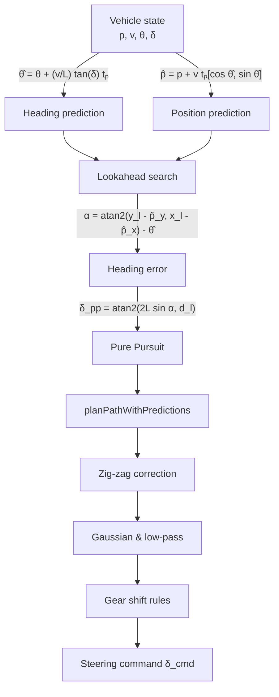

Here
$\hat{\theta} = \theta + \tfrac{v}{L}\tan(\delta) t_p$ and
$\hat{p} = p + v t_p[\cos\hat{\theta},\sin\hat{\theta}]$ represent the
predicted heading and position after time $t_p$. From the predicted position
the controller computes
α = atan2(yₗ - p̂_y, xₗ - p̂_x) - θ̂
and distance $d_l$ to the target waypoint. `planPathWithPredictions` then
adjusts the reference path to eliminate zig\-zag oscillations before the
Gaussian and low-pass filters and the gear-shift logic are applied.

##### Pure Pursuit Block
The **Pure Pursuit** block encapsulates the steering computation carried out once
the predicted pose is available. Internally it:

1. **Locates a lookahead point** using `findLookaheadPoint`. The routine walks
   along upcoming segments until a point at least `lookaheadDistance` from the
   predicted position is found, interpolating between waypoints when necessary.
2. **Computes heading error and curvature.** The heading error is
   α = atan2(yₗ − p̂_y, xₗ − p̂_x) − θ̂. 
   Curvature follows as 
   κ = 2 · sin(α) / lookaheadDistance 
   and the raw steering request is 
   δ_raw = arctan(wheelbase × κ)
   clamped to the maximum steering angle.
3. **Applies smoothing and rate limits.** The command passes through an
   exponential moving average, Gaussian and low-pass filters while the change
   between updates is limited by `maxSteeringRate`.
4. **Integrates gear shifting.** If upcoming curvature exceeds
   `curvatureShiftThreshold`, the block commands the transmission to shift down
   and may reduce speed.

Simplified pseudocode:

```matlab
lookahead = findLookaheadPoint(predPos);
alpha = wrapToPi(atan2(lookahead(2)-predPos(2), lookahead(1)-predPos(1)) - predTheta);
kappa = 2 * sin(alpha) / lookaheadDistance;
delta_raw = atan(wheelbase * kappa);
delta_filtered = gaussian(lowpass(alphaGain*delta_raw + (1-alphaGain)*prevDelta));
```

The resulting `delta_filtered` is forwarded to the limiter blocks and the
Ackermann steering model.

These modules exchange commands with the mechanical subsystems in the vehicle
model diagram above.  They also use the filter chain described later to smooth
all signals.

The diagram below places the controllers around the mechanical drivetrain to
highlight how commands and feedback loop through the system.

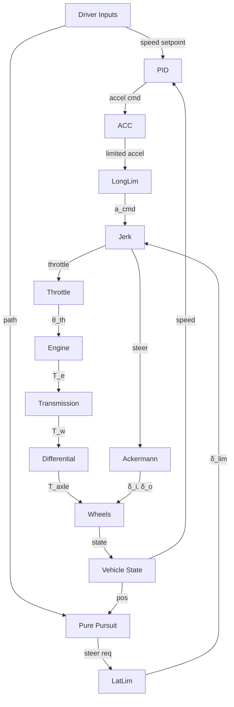

#### Pure Pursuit Algorithm
The path follower selects a lookahead point ahead of the vehicle to compute the
target steering angle.  The classical pure pursuit method uses a single point at
distance $d$ and applies

$$
\delta = \tan^{-1}\frac{2L \sin \alpha}{d}
$$

where $L$ is the wheelbase and $\alpha$ the heading error.  VDSS extends this by
projecting several future waypoints, averaging the resulting curvatures and then
filtering the command with Gaussian and low-pass stages before actuating the
Ackermann steering.


###### Planned Path
*Outputs*: waypoints $(x_i, y_i)$ describing the reference trajectory.

###### Lookahead Search
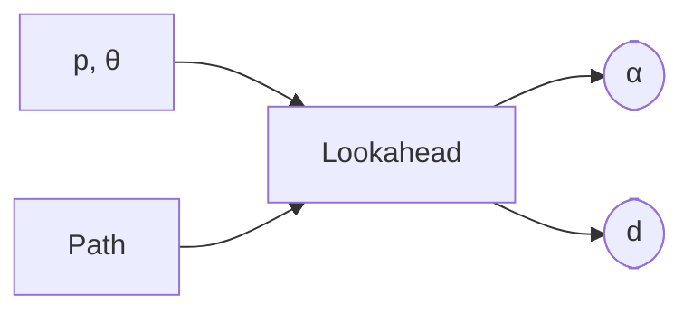
*Inputs*: current pose $(p,\theta)$ and planned path.
*Outputs*: heading error $\alpha$ and lookahead distance $d$.

The algorithm picks the first waypoint at distance $d$ ahead of the vehicle and computes
α = atan2(yₗ - p̂_y, xₗ - p̂_x) - θ̂

###### Compute Curvature
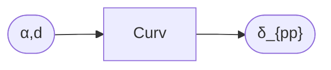
*Inputs*: heading error $\alpha$, distance $d$, wheelbase $L$.
*Output*: raw steering angle $\delta_{pp}$.

$$\delta_{pp} = \tan^{-1}\tfrac{2L \sin \alpha}{d}$$

###### Gaussian Filter
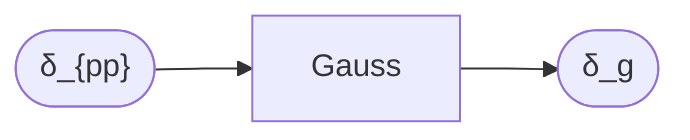
*Input*: raw steering $\delta_{pp}$.
*Output*: smoothed value $\delta_g$.

δ_g[k] = ∑₍ᵢ₌₋ₙ₎ⁿ wᵢ · δ_pp[k - i]
Parameters:
  - $w_i$ – Gaussian weights
  - $\delta_{pp}[k-i]$ – raw steering samples
  - $n$ – filter half-window size
  - $\delta_g[k]$ – filtered steering output

###### Low-pass Filter
```mermaid
flowchart LR
  delta_g(["δ_g"]) --> LowPass
  LowPass --> delta(["δ"])
```
*Input*: smoothed command $\delta_g$.
*Output*: filtered steering angle $\delta$.

δ[k] = α_f · δ_g[k] + (1 − α_f) · δ[k−1]
Parameters:
  - $\alpha_f$ – low-pass filter coefficient
  - $\delta_g[k]$ – current smoothed value
  - $\delta[k-1]$ – previous output
  - $\delta[k]$ – filtered steering command

###### Ackermann Steering
```mermaid
flowchart LR
  delta(["δ"]) --> Ackermann
  Ackermann --> delta_i(["δ_i"])
  Ackermann --> delta_o(["δ_o"])
```
*Input*: commanded steering angle $\delta$.
*Outputs*: inner and outer wheel angles $\delta_i$, $\delta_o$.

The geometry obeys $\tan \delta_{i,o} = \tfrac{L}{R \mp W/2}$, converting the steering angle to wheel angles.

#### Control Limiters
Both steering and longitudinal actuation are limited according to speed
dependent curves.  The curves are provided as Excel files so they can be tuned
without modifying the code.

*Longitudinal limits*
$a_cmd = \mathrm{clip}\bigl( a_{des},\; a_{min}(v),\; a_{max}(v) \bigr)$
Parameters:
  - $a_{des}$ – desired acceleration (m/s²)
  - $a_{min}(v)$ – speed-dependent minimum acceleration (m/s²)
  - $a_{max}(v)$ – speed-dependent maximum acceleration (m/s²)
  - $a_{cmd}$ – limited acceleration command
Acceleration and braking bounds $a_{max}(v)$ and $a_{min}(v)$ are read from
`accelCurve.xlsx` and `decelCurve.xlsx`.  Desired acceleration is first passed
through a Gaussian filter and then ramped over several steps to avoid jerks.

*Lateral limits*
$δ_lim = \mathrm{interp}(v,\, speedData,\, maxAngleData)$
Parameters:
  - $v$ – vehicle speed (m/s)
  - $speedData$ – calibration speed breakpoints
  - $maxAngleData$ – allowable steering angles
  - $δ_lim$ – speed-limited steering angle
`steerLimits.xlsx` contains pairs of vehicle speed and maximum steering angle.
The limiter clamps the requested angle to $\pmδ_lim$ each update.

### Tests
MATLAB test functions under `tests/` validate controllers, vehicle dynamics and localization routines. Run `runtests('tests')` inside MATLAB to execute all unit tests.

## Parameters
`VehicleModel.initializeDefaultParameters` exposes many tunable values. Key groups include:
- **Basic Configuration:** trailer inclusion, masses, initial velocity and inertia multipliers.
- **Geometry:** lengths, widths, center-of-gravity heights, wheelbase and track widths.
- **Tire & Suspension:** tire sizes, pressure matrices and spring/damping constants.
- **Engine & Transmission:** maximum torque, gear ratios, shift speeds and clutch behaviour.
- **Controllers:** PID gains, acceleration/steering limits and maximum speed.
- **Road & Environment:** slope angle, friction coefficient, aerodynamic drag and wind settings.

Example snippet:
```matlab
params.tractorMass = 8000;      % kg
params.trailerMass = 7000;      % kg
params.maxSpeed = 25.0;         % m/s speed limiter
params.Kp = 1.0;                % PID proportional gain
params.gearRatios = [14.94 11.21 8.31 6.26 ...];
```

### Full Parameter List
The table below summarises the most important configuration options. Each value
is loaded into the relevant mechanical block or controller at simulation start.

| Parameter | GUI Label | Tab | Description |
|-----------|-----------|-----|-------------|
|`includeTrailer`|Include Trailer|Basic Configuration|Attach trailer; enables hitch dynamics.|
|<a name="param-tractorMass"></a>`tractorMass`|Tractor Mass (kg)|Basic Configuration|Mass of tractor affecting inertia.|
|<a name="param-trailerMass"></a>`trailerMass`|Trailer Box Weight (kg)|Basic Configuration|Trailer mass used when trailer enabled.|
|`enableLogging`|Enable Logging|Basic Configuration|Record simulation data to file.|
|`initialVelocity`|Initial Velocity (m/s)|Basic Configuration|Starting speed of vehicle.|
|`vehicleType`|Vehicle Type|Basic Configuration|Preset geometry and tuning.|
|<a name="param-I_trailerMultiplier"></a>`I_trailerMultiplier`|Trailer Inertia Multiplier|Advanced Configuration|Scaling factor for trailer inertia.|
|<a name="param-maxDeltaDeg"></a>`maxDeltaDeg`|Max Articulation Angle (deg)|Advanced Configuration|Maximum articulation angle.|
|`dtMultiplier`|Time Step Multiplier|Advanced Configuration|Integration time step multiplier.|
|`windowSize`|Signal Smoothing Window Size (sec)|Advanced Configuration|Window size for smoothing filters.|
|`steeringCurveFilePath`|Steering Curve File|Control Limits|Excel file defining steering limits.|
|`maxSteeringAngleAtZeroSpeed`|Max Steering Angle at 0 Speed (deg)|Control Limits|Steering angle limit at standstill.|
|`maxSteeringSpeed`|Max Speed for Steering Limit (m/s)|Control Limits|Speed above which steering is limited.|
|`minAccelAtMaxSpeed`|Acceleration at Max Speed (m/s²)|Control Limits|Accel capability at top speed.|
|`minDecelAtMaxSpeed`|Deceleration at Max Speed (m/s²)|Control Limits|Decel capability at top speed.|
|`accelCurveFilePath`|Acceleration Curve File|Control Limits|File of speed-dependent acceleration limits.|
|`decelCurveFilePath`|Deceleration Curve File|Control Limits|File of speed-dependent braking limits.|
|`maxSpeed`|Maximum Speed Limit (m/s)|Control Limits|Absolute speed limiter.|
|`maxSpeedForAccelLimiting`|Max Speed for Accel Limiting (m/s)|Control Limits|Speed where accel limits apply.|
|`Kp`|Proportional Gain (Kp)|PID Controller|PID proportional gain.|
|`Ki`|Integral Gain (Ki)|PID Controller|PID integral gain.|
|`Kd`|Derivative Gain (Kd)|PID Controller|PID derivative gain.|
|`lambda1Accel`|Lambda1 Accel|PID Controller|Levant differentiator gain.|
|`lambda2Accel`|Lambda2 Accel|PID Controller|Levant differentiator gain.|
|`lambda1Jerk`|Lambda1 Jerk|PID Controller|Levant differentiator for jerk.|
|`lambda2Jerk`|Lambda2 Jerk|PID Controller|Levant differentiator for jerk.|
|`lambda1Vel`|Lambda1 Velocity|PID Controller|Levant differentiator for velocity.|
|`lambda2Vel`|Lambda2 Velocity|PID Controller|Levant differentiator for velocity.|
|`enableSpeedController`|Enable Speed Controller|PID Controller|Enable closed-loop speed control.|
|`tractorLength`|Length (m)|Vehicle Parameters|Length of tractor chassis.|
|`tractorWidth`|Width (m)|Vehicle Parameters|Width of tractor chassis.|
|`tractorHeight`|Height (m)|Vehicle Parameters|Height of tractor body.|
|`tractorCoGHeight`|CG Height (m)|Vehicle Parameters|Center of gravity height.|
|`tractorWheelbase`|Wheelbase (m)|Vehicle Parameters|Distance between axles.|
|`tractorTrackWidth`|Track Width (m)|Vehicle Parameters|Width between left and right wheels.|
|`tractorNumAxles`|Number of Axles (1-2)|Vehicle Parameters|Number of tractor axles.|
|`tractorAxleSpacing`|Axle Spacing (m)|Vehicle Parameters|Spacing between tractor axles.|
|`numTiresPerAxleTractor`|Number of Tires per Axle (Tractor)|Vehicle Parameters|Tires per tractor axle.|
|`trailerLength`|Length (m)|Trailer Parameters|Length of trailer.|
|`trailerWidth`|Width (m)|Trailer Parameters|Width of trailer.|
|`trailerHeight`|Height (m)|Trailer Parameters|Height of trailer.|
|`trailerCoGHeight`|CG Height (m)|Trailer Parameters|Trailer center of gravity height.|
|`trailerWheelbase`|Wheelbase (m)|Trailer Parameters|Trailer wheelbase.|
|`trailerTrackWidth`|Track Width (m)|Trailer Parameters|Trailer track width.|
|`trailerAxleSpacing`|Axle Spacing (m)|Trailer Parameters|Spacing between trailer axles.|
|<a name="param-trailerHitchDistance"></a>`trailerHitchDistance`|Trailer Hitch Distance (m)|Trailer Parameters|Distance from tractor hitch to trailer.|
|<a name="param-tractorHitchDistance"></a>`tractorHitchDistance`|Tractor Hitch Distance (m)|Trailer Parameters|Distance from rear axle to hitch.|
|`numTiresPerAxleTrailer`|Number of Tires per Axle on Trailer|Trailer Parameters|Tires per trailer axle.|
|`trailerNumBoxes`|Num Trailer Boxes|Trailer Parameters|Number of cargo boxes.|
|`trailerAxlesPerBox`|Axles per Box (comma-separated)|Trailer Parameters|Axles per cargo box.|
|`trailerBoxSpacing`|Box Spacing (m)|Trailer Parameters|Spacing between boxes.|
|<a name="param-tractorTireHeight"></a>`tractorTireHeight`|Tractor Tire Height (m)|Tires Configuration|Tractor tire outer diameter.|
|<a name="param-tractorTireWidth"></a>`tractorTireWidth`|Tractor Tire Width (m)|Tires Configuration|Tractor tire width.|
|<a name="param-trailerTireHeight"></a>`trailerTireHeight`|Trailer Tire Height (m)|Tires Configuration|Trailer tire outer diameter.|
|<a name="param-trailerTireWidth"></a>`trailerTireWidth`|Trailer Tire Width (m)|Tires Configuration|Trailer tire width.|
|`stiffnessX`|Stiffness X (N/m)|Stiffness & Damping|Chassis spring stiffness in X.|
|`stiffnessY`|Stiffness Y (N/m)|Stiffness & Damping|Chassis spring stiffness in Y.|
|`stiffnessZ`|Stiffness Z (N/m)|Stiffness & Damping|Chassis spring stiffness in Z.|
|`stiffnessRoll`|Stiffness Roll (N·m/rad)|Stiffness & Damping|Roll stiffness for chassis.|
|`stiffnessPitch`|Stiffness Pitch (N·m/rad)|Stiffness & Damping|Pitch stiffness for chassis.|
|`stiffnessYaw`|Stiffness Yaw (N·m/rad)|Stiffness & Damping|Yaw stiffness for chassis.|
|`dampingX`|Damping X (N·s/m)|Stiffness & Damping|Damping coefficient in X.|
|`dampingY`|Damping Y (N·s/m)|Stiffness & Damping|Damping coefficient in Y.|
|`dampingZ`|Damping Z (N·s/m)|Stiffness & Damping|Damping coefficient in Z.|
|`dampingRoll`|Damping Roll (N·m·s/rad)|Stiffness & Damping|Roll damping of chassis.|
|`dampingPitch`|Damping Pitch (N·m·s/rad)|Stiffness & Damping|Pitch damping of chassis.|
|`dampingYaw`|Damping Yaw (N·m·s/rad)|Stiffness & Damping|Yaw damping of chassis.|
|<a name="param-K_spring"></a>`K_spring`|Spring Stiffness K_spring (N/m)|Suspension Model|Suspension spring constant.|
|<a name="param-C_damping"></a>`C_damping`|Damping Coefficient C_damping (N·s/m)|Suspension Model|Suspension damping coefficient.|
|<a name="param-restLength"></a>`restLength`|Rest Length (m)|Suspension Model|Suspension rest length.|
|<a name="param-maxEngineTorque"></a>`maxEngineTorque`|Max Engine Torque (Nm)|Engine Configuration|Engine torque peak.|
|<a name="param-maxPower"></a>`maxPower`|Max Power (W)|Engine Configuration|Engine maximum power.|
|<a name="param-idleRPM"></a>`idleRPM`|Idle RPM|Engine Configuration|Engine idle speed.|
|<a name="param-redlineRPM"></a>`redlineRPM`|Redline RPM|Engine Configuration|Maximum engine RPM.|
|<a name="param-engineBrakeTorque"></a>`engineBrakeTorque`|Engine Brake Torque (Nm)|Engine Configuration|Engine braking torque.|
|<a name="param-fuelConsumptionRate"></a>`fuelConsumptionRate`|Fuel Consumption Rate (kg/s)|Engine Configuration|Fuel used per second.|
|<a name="param-torqueFileName"></a>`torqueFileName`|Torque File (Excel)|Engine Configuration|Excel torque curve file.|
|<a name="param-maxBrakingForce"></a>`maxBrakingForce`|Max Braking Force (N)|Brake Configuration|Maximum wheel braking force.|
|<a name="param-brakingForce"></a>`brakingForce`|Braking Force (N)|Brake Configuration|Constant braking force command.|
|<a name="param-brakeEfficiency"></a>`brakeEfficiency`|Brake Efficiency (%)|Brake Configuration|Brake efficiency percentage.|
|<a name="param-brakeBias"></a>`brakeBias`|Brake Bias (Front/Rear %)|Brake Configuration|Front/rear brake split.|
|<a name="param-brakeType"></a>`brakeType`|Brake Type|Brake Configuration|Type of brake system.|
|<a name="param-maxClutchTorque"></a>`maxClutchTorque`|Max Clutch Torque (Nm)|Clutch Configuration|Maximum clutch torque.|
|<a name="param-engagementSpeed"></a>`engagementSpeed`|Clutch Engagement Speed (1/10 s)|Clutch Configuration|Clutch engagement time.|
|<a name="param-disengagementSpeed"></a>`disengagementSpeed`|Clutch Disengagement Speed (1/10 s)|Clutch Configuration|Clutch disengagement time.|
|<a name="param-airDensity"></a>`airDensity`|Air Density (kg/m³)|Aerodynamics|Air density for drag calculations.|
|<a name="param-dragCoeff"></a>`dragCoeff`|Drag Coefficient|Aerodynamics|Vehicle drag coefficient.|
|<a name="param-windSpeed"></a>`windSpeed`|Wind Speed (m/s)|Aerodynamics|Ambient wind speed.|
|<a name="param-windAngleDeg"></a>`windAngleDeg`|Wind Angle (deg)|Aerodynamics|Wind angle relative to vehicle.|
|`slopeAngle`|Slope Angle (degrees)|Road Conditions|Road slope angle.|
|`roadFrictionCoefficient`|Road Friction Coefficient (μ)|Road Conditions|Road-tire friction coefficient.|
|`roadSurfaceType`|Road Surface Type|Road Conditions|Type of road surface.|
|`roadRoughness`|Road Roughness|Road Conditions|Roughness affecting vibrations.|
|<a name="param-maxGear"></a>`maxGear`|Maximum Gear Number|Transmission Configuration|Number of transmission gears.|
|<a name="param-finalDriveRatio"></a>`finalDriveRatio`|Final Drive Ratio|Transmission Configuration|Final drive ratio.|
|<a name="param-gearRatios"></a>`gearRatios`|Gear Ratios|Gear Ratios|Transmission gear ratios.|
|<a name="param-shiftUpSpeed"></a>`shiftUpSpeed`|Shift Up Speeds (m/s)|Transmission Configuration|Speeds at which to upshift.|
|<a name="param-shiftDownSpeed"></a>`shiftDownSpeed`|Shift Down Speeds (m/s)|Transmission Configuration|Speeds at which to downshift.|
|<a name="param-shiftDelay"></a>`shiftDelay`|Shift Delay (s)|Transmission Configuration|Delay between gear changes.|
|`flatTireIndices`|Flat Tire Indices|Commands|Indices of tires starting flat.|
|`steeringCommands`|Steering Commands|Commands|Scripted steering inputs.|
|`accelerationCommands`|Acceleration Commands|Commands|Scripted acceleration inputs.|
|`tirePressureCommands`|Tire Pressure Commands|Commands|Commands adjusting tire pressure.|
|`pressureMatrices`|Pressure Matrices|Pressure Matrices|Matrices of tire pressures.|
|`maxAccelAtZeroSpeed`|Acceleration at 0 Speed (m/s²)|Control Limits|Accel limit at zero speed.|
|`maxDecelAtZeroSpeed`|Deceleration at 0 Speed (m/s²)|Control Limits|Decel limit at zero speed.|
|<a name="param-pacejka"></a>`pCx1..pKy3`|Pacejka Coefficients|Tire Model|Pacejka tire model coefficients.|
|`spinnerConfigs`|Spinner Configs|Stiffness & Damping|Spinner graphics config.|
|`mapCommands`|Map Commands|Mapping|Map creation string.|
|`waypoints`|Waypoints|Path Follower|Explicit waypoint list.|

### Parameter-Formula Links
The table above shows the main GUI parameters. The formulas governing each
component are described below and linked to their relevant settings:

- [`tractorMass`](#param-tractorMass), [`trailerMass`](#param-trailerMass) → [Dynamics](#dynamics)
- [`maxEngineTorque`](#param-maxEngineTorque), [`torqueFileName`](#param-torqueFileName) → [Engine](#engine)
- [`maxClutchTorque`](#param-maxClutchTorque) → [Clutch](#clutch)
- [`gearRatios`](#param-gearRatios), [`finalDriveRatio`](#param-finalDriveRatio) → [Transmission](#transmission)
- [`maxBrakingForce`](#param-maxBrakingForce), [`brakeEfficiency`](#param-brakeEfficiency) → [BrakeSystem](#brakesystem)
- [`K_spring`](#param-K_spring), [`C_damping`](#param-C_damping) → [LeafSpringSuspension](#leafspringsuspension)
- [`pCx1..pKy3`](#param-pacejka) → [Pacejka96TireModel and PacejkaMagicFormula](#pacejka96tiremodel-and-pacejkamagicformula)
- [`airDensity`](#param-airDensity), [`dragCoeff`](#param-dragCoeff) → [Aerodynamic drag](#dynamics)

### Parameter → Variable Mapping
The list below clarifies which variables in the equations are controlled by each
parameter. Only the most relevant pairs are shown.

| Parameter | Formula variable |
|-----------|------------------|
|`tractorMass`, `trailerMass`|$m$ in $\tfrac{du}{dt} = F_x/m$|
|`tractorTireHeight`, `trailerTireHeight`|Wheel radius $R$ in $\kappa=(\omega R-v_x)/\max(v_x,0.1)$|
|`maxEngineTorque`, `torqueFileName`|$T_e$ curve in $T_e=f(\omega_e)\theta_{th}$|
|`maxClutchTorque`|$T_{\max}$ in $T_c=(1-e)\,T_{\max}$|
|`gearRatios`, `finalDriveRatio`|$gearRatio$, $finalDrive$ in $T_w=T_c\,gearRatio\,finalDrive$|
|`maxBrakingForce`, `brakeEfficiency`|$F_{brake}=u_b\,maxBrakingForce\,brakeEfficiency$|
|`K_spring`, `C_damping`|$K$, $C$ in $F_s=-K\,\Delta x-C\,v$|
|`pCx1..pKy3`|Pacejka $B,C,D,E$ coefficients|
|`airDensity`, `dragCoeff`|$\rho$, $C_d$ in $F_d=0.5\,\rho\,C_d\,A\,v^2$|
|`windSpeed`, `windAngleDeg`|Wind vector for relative speed in drag formula|
|`maxDeltaDeg`|$\delta_{\max}$ limit in hitch model|

```mermaid
flowchart LR
  Basic --> VehicleModel
  Geometry --> VehicleModel
  Tire --> Wheels
  Suspension --> SuspensionBlock[LeafSpring]
  EngineParams --> Engine
  TransmissionParams --> Transmission
  BrakeParams --> BrakeSystem
  Control --> Controllers
  Aerodynamics --> ForceCalc
  Road --> SurfaceFrictionManager
```

### GUI Tabs and Inputs
`VehicleGUIManager` organises parameters across multiple configuration tabs.  At
run time these settings are written into `VehicleModel` and its controllers as
shown below.

```mermaid
flowchart LR
  GUI -->|fields| VehicleParams
  GUI -->|controller gains| Controllers
  VehicleParams --> VehicleModel
  Controllers --> VehicleModel
```

Key tabs include:

- **Basic Configuration** – masses, inclusion of a trailer and log options.
- **Control Limits** – upload Excel curves for steering and acceleration
  limiters and tune ramping windows.
- **PID Controller** – set gains and jerk limits for speed tracking.
- **Tires & Suspension** – define tire pressures, spring rates and damping.
- **Engine/Transmission** – torque curves, gear ratios and shift logic.
- **Path Follower** – waypoints and lookahead distance for pure pursuit.
- **Commands** – steering, throttle and tire pressure scripts executed during a
  run.

Changing any of these fields immediately updates the parameters used in the next
simulation step, enabling rapid calibration of the entire vehicle model.

### Modeling Your Vehicle
The GUI allows assembling custom vehicles by filling out the fields above. Two
presets are included:

1. **Passenger Vehicle** – a car without a trailer. This profile uses
   moderate masses and a short wheelbase.
2. **Class 8 Truck + Trailer** – heavy tractor with one box trailer attached.
   Selecting this preset fills in large masses, multiple axles and long gear
   ratios.

To build your own vehicle:

1. Start VDSS and open the **Basic Configuration** tab.
2. Pick either preset as a starting point or enter your own masses and geometry.
3. Load engine torque and limiter curves as well as braking and steering limits
   from your Excel configuration files.
4. Adjust controller gains in the **PID Controller** tab.
5. Specify lookahead distance and waypoints under **Path Follower**.
6. Save the resulting parameter set for future runs.

### Example Parameters: Class 8 Truck
Below is a sample of the parameters used for the heavy truck preset. These values
are taken from `Class8Truck_And_Sedan_CollisionFrontEnd.xml` shipped with the repository.

| Parameter | Example Value |
|-----------|---------------|
|`includeTrailer`|`true`|
|`tractorMass`|`9070` kg|
|`trailerMass`|`7000` kg|
|`initialVelocity`|`10` m/s|
|`W_FrontLeft`|`669`|
|`W_FrontRight`|`669`|
|`W_RearLeft`|`446`|
|`W_RearRight`|`446`|
|`maxClutchTorque`|`3500` Nm|
|`engagementSpeed`|`1`|
|`disengagementSpeed`|`0.5`|
|`torqueFileName`|`class8_truck_torque_curve.xlsx`|
|`I_trailerMultiplier`|`1`|
|`maxDeltaDeg`|`70`|
|`dtMultiplier`|`0.5`|
|`windowSize`|`1`|
|`tractorLength`|`6.5` m|
|`tractorWidth`|`2.5` m|
|`tractorHeight`|`3.8` m|
|`tractorCoGHeight`|`1.5` m|
|`tractorWheelbase`|`4` m|
|`tractorTrackWidth`|`2.1` m|
|`tractorNumAxles`|`2`|
|`tractorAxleSpacing`|`1.31` m|
|`numTiresPerAxleTrailer`|`4`|
|`numTiresPerAxleTractor`|`4`|
|`trailerLength`|`12` m|
|`trailerWidth`|`2.5` m|
|`trailerHeight`|`4` m|
|`trailerCoGHeight`|`1.5` m|
|`trailerWheelbase`|`8` m|
|`trailerTrackWidth`|`2.1` m|
|`trailerNumAxles`|`2`|
|`trailerAxleSpacing`|`1.31` m|
|`trailerHitchDistance`|`1.31` m|
|`tractorHitchDistance`|`4.5` m|
|`steeringCommands`|`simval_(195)|ramp_-30(1)|keep_-30(0.8)|ramp_0(0.2)|keep_0(1)`|
|`accelerationCommands`|`simval_(200)`|
|`tirePressureCommands`|`pressure_(t:150-[tire:9,psi:70];[tire:2,psi:72];[tire:1,psi:7])`|
|`maxEngineTorque`|`3000` Nm|
|`maxPower`|`400000` W|
|`idleRPM`|`600`|
|`redlineRPM`|`2100`|
|`engineBrakeTorque`|`1500`|
|`fuelConsumptionRate`|`0.2`|
|`maxSteeringAngleAtZeroSpeed`|`30`|
|`steeringCurveFilePath`|`class8_truck_SteeringCurve.xlsx`|
|`maxSteeringSpeed`|`30`|
|`brakingForce`|`50000`|
|`brakeEfficiency`|`85`|
|`brakeBias`|`50`|
|`brakeType`|`Air Disk`|
|`maxBrakingForce`|`60000`|
|`maxGear`|`6`|
|`gearRatios`|`14.4,12.53,10.91,9.51,8.34,7.31,6.39,5.57,4.83,4.17,3.59,3.08,2.62,2.21,1.86,1.55,1.28,1.07`|
|`finalDriveRatio`|`3.42`|
|`shiftUpSpeed`|`3,5,7,9,11,13,15,17,19,21,23,25,27,29,31,33,35,37`|
|`shiftDownSpeed`|`2.5,4.5,6.5,8.5,10.5,12.5,14.5,16.5,18.5,20.5,22.5,24.5,26.5,28.5,30.5,32.5,34.5,36.5`|
|`shiftDelay`|`0.5`|
|`minAccelAtMaxSpeed`|`1`|
|`minDecelAtMaxSpeed`|`-1`|
|`accelCurveFilePath`|`class8_truck_AccelCurve.xlsx`|
|`decelCurveFilePath`|`class8_truck_DecelCurve.xlsx`|
|`maxSpeedForAccelLimiting`|`30`|
|`Kp`|`1`|
|`Ki`|`0.5`|
|`Kd`|`0.1`|
|`enableSpeedController`|`1`|
|`maxSpeed`|`25`|
|`tractorTireHeight`|`1`|
|`tractorTireWidth`|`0.3`|
|`trailerTireHeight`|`1`|
|`trailerTireWidth`|`0.3`|
|`airDensity`|`1.225`|
|`dragCoeff`|`0.8`|
|`windSpeed`|`0`|
|`windAngleDeg`|`45`|
|`slopeAngle`|`0`|
|`roadFrictionCoefficient`|`0.9`|
|`roadSurfaceType`|`Dry Asphalt`|
|`roadRoughness`|`0`|
|`stiffnessX`|`10000`|
|`stiffnessY`|`10000`|
|`stiffnessZ`|`50000`|
|`stiffnessRoll`|`5000`|
|`stiffnessPitch`|`1000`|
|`stiffnessYaw`|`2000`|
|`dampingX`|`100000`|
|`dampingY`|`100000`|
|`dampingZ`|`50000`|
|`dampingRoll`|`5000`|
|`dampingPitch`|`1000`|
|`dampingYaw`|`2000`|
|`K_spring`|`30000`|
|`C_damping`|`1500`|
|`restLength`|`0.5`|
|`pCx1`|`700000`|
|`pDx1`|`700000`|
|`pDx2`|`700000`|
|`pEx1`|`10`|
|`pEx2`|`0.1`|
|`pEx3`|`0.05`|
|`pEx4`|`0.03`|
|`pKx1`|`60000`|
|`pKx2`|`0.8`|
|`pKx3`|`0.8`|
|`pCy1`|`700000`|
|`pDy1`|`700000`|
|`pDy2`|`700000`|
|`pEy1`|`10`|
|`pEy2`|`0.1`|
|`pEy3`|`0.05`|
|`pEy4`|`0.03`|
|`pKy1`|`60000`|
|`pKy2`|`0.8`|
|`pKy3`|`0.8`|
|`pressureMatrices`|`780000,780000,785000,785000,790000,790000,795000,795000,800000,800000,805000,805000,810000,810000,815000,815000,820000,820000`|

### Passenger Vehicle Configuration Script
The script `Scripts/passengerVehicleConfigWindow.m` creates a minimal dialog with
the preset values for a passenger car. Run it inside MATLAB to view and modify
the parameters interactively.

The diagram below illustrates how each group of GUI fields links to the
mechanical and control blocks:

```mermaid
flowchart LR
  Basic --> VehicleModel
  Geometry --> VehicleModel
  Tire --> Wheels
  Suspension --> SuspensionBlock[LeafSpring]
  EngineParams --> Engine
  TransmissionParams --> Transmission
  BrakeParams --> BrakeSystem
  Control --> Controllers
  Aerodynamics --> ForceCalc
  Road --> SurfaceFrictionManager
```

## Capabilities
- Simulate two vehicles with optional trailers in parallel.
- Detect and report collisions and severity metrics.
- Visualize runs in 2‑D or 3‑D including articulated trailers.
- Export logs and configurations to XML, CSV, MAT and PNG files.
- Generate lane maps on the fly from command strings.

## Architecture Diagram
```
[UIManager] <-> [SimManager] <-> [VehicleModel] <-> [HitchModel] <-> [Physics & Mechanics]
       |                         |
   [PlotManager]            [Map / Localizer]
```

## Getting Help
Use `help <FunctionName>` inside MATLAB for detailed function comments. The `Scripts` directory contains helper utilities for building MEX files and running batch jobs.

## License
This project is licensed under the GNU General Public License v3. See the [LICENSE](LICENSE) file for details.

## Command Inputs and Track Generation
`VehicleModel` exposes several command strings to automate test cases:
- **`mapCommands`** – a `|` separated list describing lane segments.
  - `straight(x1,y1,x2,y2)` adds a straight from `(x1,y1)` to `(x2,y2)`.
  - `curve(cx,cy,r,theta1,theta2,dir)` adds an arc around `(cx,cy)` with radius `r` from `theta1` to `theta2` degrees. `dir` is `cw` or `ccw`.
  - Example:
    ```matlab
    params.mapCommands = "straight(100,200,300,200)|curve(300,250,50,270,90,ccw)";
    map = LaneMap(400,400);
    map = map.processLaneCommands(params.mapCommands);
    map.plotLaneMapWithCommands(gca, params.mapCommands, 'k');
    ```
- **`steeringCommands` / `accelerationCommands`** – sequences like `"time angle; ..."` or `"time accel; ..."` that set steering angles or throttle percentages at specific times. These strings are interpreted by `VehicleGUIManager` and forwarded to controllers.
- **`tirePressureCommands`** – adjusts individual tire pressures during a run.
- **`flatTireIndices`** – vector of tire indices that should fail. `ForceCalculator` reduces Pacejka stiffness and friction for these wheels, effectively simulating a blow‑out.

## Collision Analysis
`VehicleCollisionSeverity` estimates delta‑V values using SAE&nbsp;J2980 tables. For heavy trucks the thresholds scale with kinetic energy:
```matlab
scale = sqrt(J2980AssumedMaxMass / vehicleMass);
thresholds = baseDV * scale;  % baseDV from J2980 table
```
Collision energy is computed as $0.5 \times m \times \Delta v^2$ and compared with severity thresholds. This extension allows comparing truck crashes against J2980 passenger‑car limits by specifying `J2980AssumedMaxMass` in the GUI.

## Physics Models
The blocks above are tied together using classical vehicle dynamics. The process
for each simulation step is summarized below.

1. **Slip and Tire Forces**
   - Slip ratio: $\kappa = (\omega R - v_x)/\max(v_x,0.1)$
   - Slip angle: $\alpha = \tan^{-1}(v_y / |v_x|)$
   - Pacejka '96 formula gives the tire forces:
Fₓ = Dₓ · sin( Cₓ · arctan( Bₓ · κ − Eₓ · (Bₓ · κ − arctan(Bₓ · κ)) ) )
F_y = D_y · sin( C_y · arctan( B_y · α − E_y · (B_y · α − arctan(B_y · α)) ) )

2. **Force Summation**
    - Aerodynamic drag: $F_d = 0.5 \times \rho \times C_d \times A \times v^2$
    - Wheel force: $F_x = T_w/R_w - F_{brake} - F_d$ where
      $F_{brake} = u_b \times \mathrm{maxBrakingForce} \times \mathrm{brakeEfficiency}$
    - Net lateral force combines tire and suspension reactions.
    - Yaw moment: $M_z = l_f F_{yf} - l_r F_{yr}$

3. **Dynamics Update**
   - Longitudinal: $\tfrac{du}{dt} = F_x/m + r v$
   - Lateral: $\tfrac{dv}{dt} = F_y/m - r u$
   - Yaw: $\dot r = M_z / I_z$
   - `KinematicsCalculator` maps body velocities to global rates.

4. **RK4 Integration**
   Accelerations are integrated with `DynamicsUpdater.updateStateRK4`:
   ```
   k1 = f(y)
   k2 = f(y + dt/2 * k1)
   k3 = f(y + dt/2 * k2)
   k4 = f(y + dt * k3)
   y_{n+1} = y_n + dt/6 * (k1 + 2*k2 + 2*k3 + k4)
   ```

5. **Energy Balance**
   Collision analysis uses $E_k = 0.5 \times m \times v^2$ to compare against severity
   thresholds.

This chain transforms driver inputs into forces and accelerations that are
integrated to update position, orientation and velocity every time step.

## Physics
The simulator's physics engine combines kinematic relationships with rigid-body
dynamics. Key formulas include:

### Kinematics
- Distance under constant acceleration:
  $s = v_0 t + 0.5 \times a \times t^2$
- Final velocity:
  $v = v_0 + a \times t$
- Rotation matrix from body to world given roll $\phi$, pitch $\theta$ and yaw
  $\psi$:
  $R = R_z(\psi) R_y(\theta) R_x(\phi)$.
- Body velocities to world-frame position rates:
  $\dot x = u \cos\psi - v \sin\psi$,
  $\dot y = u \sin\psi + v \cos\psi$.
- Lateral acceleration update:
  $a_{lat} = F_y / m$
- Roll dynamics internal to `KinematicsCalculator`:
  $\mathrm{rollAccel} = (M_{roll} - D_{roll} \times \mathrm{rollRate} - K_{roll} \times \mathrm{rollAngle}) / I_{roll}$

### Dynamics
- Longitudinal motion:
  $\tfrac{du}{dt} = F_x/m + r v$
- Lateral motion:
  $\tfrac{dv}{dt} = F_y/m - r u$
- Yaw rate derivative:
  $\dot r = M_z / I_z$
- Roll rate derivative:
  $\dot p = (\mathrm{momentRoll} - m g h \sin\phi - K_{roll}\phi - C_{roll} p) / I_{xx}$
- Tire slip ratio:
  $\kappa = (\omega R - v_x)/\max(v_x,0.1)$
- Tire slip angle:
  $\alpha = \tan^{-1}(v_y / |v_x|)$
- Aerodynamic drag:
    $F_d = 0.5 \times \rho \times C_d \times A \times v^2$
  - Net longitudinal force: $F_x = T_w/R_w - F_{brake} - F_d$ with
    $F_{brake} = u_b \times \mathrm{maxBrakingForce} \times \mathrm{brakeEfficiency}$
    
Related parameters: [`airDensity`](#param-airDensity), [`dragCoeff`](#param-dragCoeff), [`windSpeed`](#param-windSpeed), [`windAngleDeg`](#param-windAngleDeg), [`tractorMass`](#param-tractorMass), [`trailerMass`](#param-trailerMass)
- Translational kinetic energy: $E_{trans} = 0.5 \times m \times (u^2 + v^2)$
- Rotational kinetic energy: $E_{rot} = 0.5 \times I \times \omega^2$
- Yaw moment from tire forces: $M_z = l_f F_{yf} - l_r F_{yr}$
- Newton's second law couples the forces and accelerations as
  $m \times a = \sum F$ and $I \times \alpha = \sum M$ for translational and rotational
  dynamics.

### Integration
Vehicle states are propagated using a classical fourth‑order Runge–Kutta (RK4)
scheme implemented in `DynamicsUpdater.updateStateRK4` and `HitchModel`:
```
k1 = f(y)
k2 = f(y + dt/2 * k1)
k3 = f(y + dt/2 * k2)
k4 = f(y + dt * k3)
y_{n+1} = y_n + dt/6 * (k1 + 2*k2 + 2*k3 + k4)
```
This integration is applied to both translational and rotational equations of
motion every simulation step.
`ForceCalculator` first determines the net force and moment acting on the
vehicle from tire grip, braking torque, aerodynamic drag, suspension reaction
and hitch constraints. `DynamicsUpdater.stateDerivative` converts these forces
into linear and angular accelerations:
$a_x = F_x/m$, $a_y = F_y/m$ and $\dot r = M_z/I_z$. `KinematicsCalculator`
then maps body velocities to world-frame position rates. The RK4 loop integrates
these derivatives so that position, velocity, orientation and roll state are
all updated consistently each time step.
The dynamic equations determine the accelerations from forces, while the kinematic relations map these accelerations to changes in position and orientation. The RK4 integrator couples them so that forces acting on the vehicle directly influence its motion each timestep.

## Derivatives, Integrals and the Levant Formula
The simulator repeatedly differentiates and integrates signals to turn driver
commands into motion.  Speed control uses a PID loop where
$a = K_p \times e + K_i \int e\,dt + K_d \times \frac{d e}{d t}$
The derivative term is obtained with the **Levant differentiator**, a robust
sliding-mode algorithm implemented in `LevantDifferentiator`. It estimates
`d(error)/dt` even when the measured speed is noisy. The integral term collects
the sum of past errors to eliminate steady offsets.

`ForceCalculator` converts throttle, brake and steering commands into forces
using the tire slip formulas and aerodynamics listed above. These forces yield
accelerations through Newton's laws. `DynamicsUpdater.updateStateRK4` then
integrates the accelerations over the timestep `dt` so that velocity and
position advance smoothly. This continuous cycle of differentiating the command
error, computing forces and integrating the resulting accelerations is what
translates user inputs into vehicle motion.

## Signal Filtering
The simulator applies several filters to commands and forces so that abrupt
changes do not destabilize the dynamics. The sequence for each signal is shown
below.

```mermaid
flowchart TD
  thCmd[Throttle Cmd] --> RateLim[Rate Limiter]
  RateLim --> Throttle
  brCmd[Brake Cmd] --> BrakeSystem
  steerCmd[Steer Cmd] --> Gauss[Gaussian]
  Gauss --> LowPass
  LowPass --> Ackermann
  shiftSig[Shift Logic] --> MovAvg1[Moving Avg]
  MovAvg1 --> Transmission
  rawForces[Raw Forces] --> MovAvg2[Moving Avg]
  MovAvg2 --> ForceCalc
```

- **Rate limiter** inside `Throttle` gradually applies driver throttle commands.
- **Moving average filters** smooth gear shifting signals and the forces returned
  by `ForceCalculator`.
- **Gaussian filter** followed by a **low‑pass filter** cleans the steering angle
  computed in `purePursuit_PathFollower`.

These filters act every step in the order shown to yield smoother actuation and
more stable simulations.

The mathematical form of each filter is:

- **Rate limiter**
$y_k = \min\bigl( \max(x_k,\,y_{k-1}-r_{\max} \Delta t),\; y_{k-1}+r_{\max} \Delta t \bigr)$
  with rate limit $r_{\max}$.
- **Gaussian filter**
$y_k = \sum_{i=-n}^{n} w_i x_{k-i}$
  where $w_i$ are normalised Gaussian weights.
- **Moving average**
$y_k = \tfrac{1}{N} \sum_{i=0}^{N-1} x_{k-i}$
- **Low-pass filter**
$y_k = \alpha x_k + (1-\alpha) y_{k-1}$

Tuning parameters like $r_{\max}$, window size $N$ and coefficient $\alpha$
are exposed in the GUI tabs so users can calibrate how aggressively commands are
smoothed.

## J2980 Extension for Heavy Vehicles
The SAE&nbsp;J2980 crash severity tables assume a passenger vehicle mass of
approximately 3000&nbsp;kg. To compare heavier vehicles such as fully loaded
class&nbsp;8 trucks, VDSS scales the delta‑V thresholds so that the equivalent
kinetic energy is matched.

### Energy-Based Scaling
For each delta‑V value $\Delta v_{car}$ from the original table we first
compute the kinetic energy it represents:

$$
E = \tfrac{1}{2} m_{\mathrm{car}} \left(\tfrac{\Delta v_{\mathrm{car}}}{3.6}\right)^2
$$

where $m_{car}$ is the maximum passenger‑vehicle mass in J2980
(3000&nbsp;kg). To find the equivalent delta‑V for a heavy vehicle of mass
$m_{hv}$ the same energy is used:

$$
\Delta v_{\mathrm{hv}} = 3.6\sqrt{\tfrac{2E}{m_{\mathrm{hv}}}}
$$

This simplifies to a scaling factor
Δv_hv = Δv_car · √(m_car / m_hv)

### Calculation Flow

```mermaid
flowchart TD
    dv["ΔV from J2980"] --> ke["KE = 0.5 * m_car * (ΔV / 3.6)^2"]
    mass["Truck mass"] --> scaled["ΔV_hv = 3.6 * sqrt(2 * KE / m_hv)"]
    ke --> scaled
```

### Extended Table for a Class 8 Truck
Using a fully loaded mass of 36&nbsp;000&nbsp;kg the scaling factor is
$$\sqrt{\tfrac{3000}{36000}} \approx 0.29$$
The delta‑V thresholds for each collision type become:

| Severity | Head-On ΔV (kph) | Rear-End ΔV (kph) | Side ΔV (kph) | Oblique ΔV (kph) |
|---------|------------------|-------------------|---------------|------------------|
| S0 | 0–2.0 | 0–2.0 | 0–0.7 | 0–1.4 |
| S1 | 2.0–10.1 | 2.0–10.1 | 0.7–1.7 | 1.4–5.9 |
| S2 | 10.1–15.2 | 10.1–15.2 | 1.7–11.3 | 5.9–13.7 |
| S3 | >15.2 | >15.2 | >11.3 | >13.7 |

These values allow the J2980 categories to be applied to heavy vehicles while
preserving the equivalent kinetic energy threshold.

## Collision Severity Determination
VDSS evaluates collisions by computing the change in velocity for each vehicle
at impact. Assuming an elastic collision between masses $m_1$ and $m_2$ with
relative speed $v_{\mathrm{rel}}$ and impact angle $\theta$, the post-impact
delta-V for vehicle&nbsp;1 is

$$
\Delta v_{\mathrm{sim}} = \frac{2 m_2}{m_1 + m_2} \, v_{\mathrm{rel}} \cos \theta.
$$

The angle $\theta$ is derived from the contact normal in the dynamics engine.
An occupant severity index follows the exponential relation proposed by
H.~Smith:

$$
\mathrm{OSI} = 1 - e^{-v_{\mathrm{rel}}/v_0}
$$

where $v_0 \approx 30\,\mathrm{kph}$ is a calibration constant. Finally the
simulated $\Delta v_{\mathrm{sim}}$ is compared against the heavy-vehicle
thresholds in the extended J2980 table to classify the crash as S0–S3.

## Simulation Output Files
After each run VDSS saves several files alongside the chosen configuration.  The
main results are stored in a MATLAB ``.mat`` file whose name starts with the
simulation name (for example ``simulation_Vehicle1_CollisionSideEnd.mat``).  The
MAT-file contains time stamped arrays for position, orientation, velocities,
accelerations, control commands and, when present, trailer states.  Typical
fields include ``Time``, ``PositionX``, ``PositionY``, ``Orientation``,
``VelocityU``, ``LateralVelocityV``, ``YawRateR``, ``RollAngle`` and
``AccelerationLongitudinal``.  Additional signals such as jerk, throttle,
gear and horse power are also exported.  If a trailer is enabled the file adds
``TrailerX``/``TrailerY`` and articulation angles.

Text and CSV log files are written using ``VehicleModel.saveLogs``.  These files
share the simulation name and record informational messages printed during the
run.  When collision analysis is active ``PlotManager`` produces a
``collision_severity_report_<timestamp>.txt`` summarizing delta‑V calculations.
A PNG image of the stability flags over time is also saved for reference.

## Plotting and Data Interpretation
The ``Scripts`` directory includes ``plotVehicleMotionResults.m`` which loads a
saved ``.mat`` file and generates a comprehensive set of figures.  Edit the
``data_file`` variable inside the script to point to your simulation output and
run it in MATLAB.  The script computes steering wheel rate, converts velocities
to kilometers per hour and displays each signal in a tiled layout.  Jerk and
force data are plotted in separate windows.  All processed signals are exported
to ``SteeringRateData.csv`` for further analysis.
